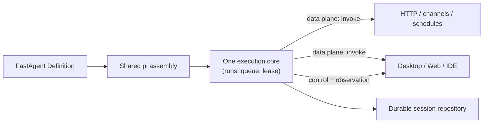

# Session control plane

This document is the serving-extension design for FastAgent. Phases 0–3 (§15) are implemented
(Phase 3's subprocess adapter stays demand-driven). It is a companion to, not a replacement
for, the locked [Agent Handler SPEC v0.1](../SPEC.md).

The whole design reduces to one sentence: **`invoke` is the only data plane; the session control
plane observes and modulates the runs that `invoke` drives.** A client uses `invoke` to make the
agent work, `dispatch` to intervene while it works, and `events` to watch.

The design adapts the useful headless primitives from pi RPC mode (steering, follow-ups, abort,
settlement, tool progress) without exposing pi's TUI control surface, raw RPC protocol, or a
second run-starting entry point.

## 1. Decision: three planes, one execution core

| Plane | Surface | Invariant |
|---|---|---|
| **Data** | `agent.invoke(scope, prompt)` | No run exists without an invoke. Every turn, and every durable conversation write, is driven by some invoke — channel, schedule, and desktop alike. |
| **Control** | `dispatch(session, command)` | Modulates, never initiates. `steer`/`follow_up` text reaches the record only through the run an invoke is driving; `abort` only changes that run's course. |
| **Observation** | `state` / `entries` / `events` | Strictly read-only. Any number of subscribers; disconnecting and resubscribing is lossless with the durable cursor; zero effect on the run. |
| **Exclusion** | the shared `Lease` | Protects writes only. A run holds it for its whole activity window. Boundary mutations (`compact`, `set_model`, `set_thinking`) are the control plane's only writers and take the same lease. |



There is no session handle, no `open`/`close`, and no resident object in the API. Residency is an
internal cache inside the serving process (see [§9](#9-concurrency-and-residency)), never a
prerequisite for calling any method. This is what "residency is an execution optimization, not the
source of continuity" means when taken seriously: the optimization is invisible in the contract.

The control plane MUST NOT change `Agent`, `Scope`, `Prompt`, `AgentEvent`, or the terminal
semantics in `src/agent.ts`. It lives behind a separate package subpath so interactive serving does
not grow the minimal handler contract.

## 2. Goals

- a desktop or Web client that watches a run live and intervenes: steer, queue a follow-up, abort;
- reconnect after a UI or network interruption without losing the conversation;
- live model, thinking, queue, retry, compaction, tool, and usage visibility;
- multiple observers of one session, naturally;
- engine-neutral consumers with capability gating;
- a future remote adapter without making its transport the embedded API.

## 3. Non-goals

- a second way to start agent work (that is `invoke`, only `invoke`);
- a durable task/workflow protocol or a replayable event log;
- a group-chat, account, membership, or deployment control plane;
- exactly-once tool execution;
- a remote shell API;
- a mirror of pi's TUI commands, editor state, themes, widgets, or window chrome;
- a promise that every engine implements every capability.

Product-level authorization, routing, offline queues, and durable run records belong above
FastAgent. A product runner may expose these planes remotely, but the runner owns authentication,
policy, idempotency, and device routing.

## 4. Terms and identity

| Term | Meaning |
|---|---|
| **Session** | Durable conversation tree identified by an opaque `sessionId` (the same value as `Scope.session`). |
| **Run** | One activity window: an invoke's accepted prompt until all steering, queued follow-ups, automatic retries, and overflow recovery have settled. |
| **Entry** | A durable append-only session record with a stable id. |
| **Event** | Ephemeral live progress on the observation plane. |

Three identifiers, each with an irreducible job:

| ID | Minted by | Lifetime | Job |
|---|---|---|---|
| `sessionId` | host/product | durable | addresses the conversation; equals `Scope.session` |
| `runId` | engine, when an invoke starts a run | one activity window | correlates control-plane acceptance with observed outcome |
| entry `id` | session repository | durable | the reconnect cursor for `entries({ since })` |

There is deliberately no `requestId`, no `runtimeId`, and no `sequence` in the embedded contract.
In-process, the `dispatch` promise is the correlation, the `events` iterable is lossless and
ordered, and iterator termination is the epoch signal. Those concerns reappear only on the wire and
belong to the transport envelope ([§13](#13-transport-and-envelope)).

## 5. The contract

Pure types under the `@fastagent-sh/fastagent/session` subpath (`src/session.ts`); the pi
implementation lives under `engines/pi/` (`session-control.ts`, exported from `/pi`).

```ts
interface SessionControl {
  capabilities(): SessionCapabilities;
  state(session: string): Promise<SessionState>;
  entries(session: string, options?: { since?: string }): Promise<SessionEntries>;
  events(session: string): AsyncIterable<SessionEvent>;
  dispatch(session: string, command: SessionCommand): Promise<SessionResult>;
}
```

All methods are session-scoped and flat: no lifecycle calls, no stateful client-visible object.
Each of the four non-capability methods survives a deletion test:

- delete `state` → a reconnecting client cannot learn whether work is still active (the durable
  record does not know whether the process died);
- delete `entries` → disconnection means amnesia (live streams are not durable);
- delete `events` → no observers, no reconnect, no rich vocabulary without polluting `AgentEvent`;
- delete `dispatch` → the invoke stream is one-way; intervention physically requires a second,
  upstream channel.

### 5.1 Commands

Six commands. There is no `prompt` command: starting work is the data plane's definition.

```ts
type SessionCommand =
  | { type: "steer"; prompt: Prompt }        // delivered after the current turn's tool calls, before the next model call
  | { type: "follow_up"; prompt: Prompt }    // FIFO queue, delivered when the run is otherwise idle
  | { type: "abort" }                        // stops the run, queues, retry delay, and cancellable tool work
  | { type: "compact"; instructions?: string }      // ┐
  | { type: "set_model"; model: string }            // ├ safe boundaries only; otherwise rejected `session_busy`
  | { type: "set_thinking"; level: string };        // ┘
```

- Queued messages are processed FIFO, one at a time. pi's queue-mode tuning is not exposed.
- `follow_up` is polyfillable (wait for `run_settled`, then invoke); it exists because it buys
  atomicity against competing writers and queue visibility, at near-zero cost since steering needs
  the queue anyway. `steer` is not polyfillable — its delivery point is an engine primitive.
- `set_model` takes a FastAgent model spec, constrained by the assembled definition and host
  policy. It never accepts provider credentials.
- `set_thinking` uses a string because supported levels are model-dependent; current allowed values
  are reported in capabilities.
- There are no `cycle_*` commands: cycling is a TUI input affordance.

### 5.2 Acceptance is not outcome

```ts
type SessionResult =
  | { ok: true; runId?: string }             // admitted (steer/follow_up: joined this run) or applied (boundary mutations)
  | { ok: false; error: { code: string; message: string; retryable: boolean } };
```

`ok: true` means the command was admitted or applied. It never means the run ultimately succeeded:
run outcomes are reported by `run_settled` on the observation plane and by the invoke stream's
terminal event. `ok: false` is guaranteed to mean rejection **before** acceptance — the only case
that is safe to blindly retry. Work that fails after acceptance surfaces through events and durable
entries, never as a second result for the same call.

### 5.3 Capabilities

```ts
interface SessionCapabilities {
  steering: boolean;
  followUp: boolean;
  manualCompaction: boolean;
  modelSelection: false | { allowedModels: string[] };
  thinkingLevel: false | { allowedLevels: string[] };
  toolProgress: boolean;
  usage: boolean;
}
```

Clients MUST gate controls on capabilities; unsupported commands fail before acceptance with a
stable `unsupported_capability` code. `state`, `entries`, and `events` are **mandatory** — they are
the reconnect contract, and an implementation that cannot honor them cannot claim this interface.
Branching (`fork`/`clone`/tree projection) and blocking interactions (typed confirm/select/input
gates that suspend a run for user input) are deliberately absent; each can arrive later as one
negotiated capability without changing this contract.

## 6. Invoke as the data plane

`invoke` keeps its SPEC v0.1 shape and stays the only way to start a run, on every path.

**Settle window.** When steering or follow-ups join a run, the invoke stream terminates when the
run **settles**: steering, queued follow-ups, automatic retries, and overflow compaction have all
finished and nothing will continue automatically. For every existing consumer — channels,
schedules, HTTP — nothing dispatches mid-run, so a run equals a single turn and behavior is
byte-identical to today. SPEC's "one turn = one invoke" gains a clarifying sentence ("a turn is the
activity window of one invoke") when the control plane lands; its terminal set `{completed,
failed}` is untouched.

**Busy semantics.** An invoke against a session with an active run fails with the existing
`session_busy` code. An interactive client seeing busy chooses `steer` or `follow_up` explicitly —
the ambiguity of "send during a run" is resolved by the client's intent, never guessed.

**Projection, not translation.** `AgentEvent` is a narrow projection of the rich event stream:

| `AgentEvent` | Source `SessionEvent` |
|---|---|
| `text { delta }` | `message_delta { channel: "text" }` |
| `thinking { delta }` | `message_delta { channel: "thinking" }` |
| `tool_started` | `tool_started` |
| `tool_ended` | `tool_finished` |
| `completed { data? }` | `run_settled { status: "completed" }` |
| `failed { details, retryable, code? }` | `run_settled { status: "failed" \| "aborted" }` |

An externally aborted run projects as `failed` with `code: "aborted"`, so a channel can render
cancellation distinctly from an error. Channels MUST treat it as a settled outcome — durable
turn-intent cleanup included — so an operator's abort is never replayed as a fresh turn on restart.

Events with no `AgentEvent` counterpart (queue, compaction, retry, tool progress) are
simply not projected. The implementation translates pi events into `SessionEvent` **once** and
derives the invoke stream from it — one translation plus one projection, never two parallel
translations.

## 7. State and durable recovery

```ts
interface SessionState {
  status: "idle" | "running" | "compacting";
  activeRunId?: string;
  model?: string;
  thinkingLevel?: string;
  pending: { steering: number; followUp: number };
  usage?: {
    inputTokens: number;
    outputTokens: number;
    cacheReadTokens?: number;
    cacheWriteTokens?: number;
    cost?: number;
    contextTokens?: number;
    contextWindow?: number;
  };
  leafEntryId?: string;
}
```

`compacting` refers to Phase 2 manual compaction at a session boundary; automatic overflow
compaction happens inside a run's activity window (before its `run_settled`) and reports as
`running` — the observation plane's "running" window equals the data plane's lease window, so
`state()` never says idle while an invoke would still be rejected `session_busy`.

There is deliberately no `failed` status. A failed run settles (`run_settled { failed }`) and the
session returns to `idle` — the conversation is intact and can continue. A serving-process fault
surfaces as `serving_error` plus event-iterator termination; recovery is resubscription, not a
sticky state with no defined exit.

`entries({ since })` is the durable reconnect primitive:

```ts
interface SessionEntries { entries: SessionEntry[]; leafEntryId?: string }

interface SessionEntry {
  id: string;
  parentId?: string;
  timestamp: number;
  kind: string;   // guaranteed minimum vocabulary: "user" | "assistant" | "tool"; open set beyond
  data: Json;
}
```

Entries are append-ordered with stable ids, including pre-compaction records and abandoned branches
where the engine preserves them — `parentId` exists because branches objectively occur (compaction)
even though branching commands are deferred. The `since` cursor is an APPEND-ORDER position ("every
record appended after this id"), not a descendant filter: in a branched session it may include
records from other branches, and the client reconstructs the active path via `parentId` chains from
`leafEntryId`. The guaranteed `kind` minimum is what a reconnecting client needs to render a
conversation; engine-specific kinds may appear beyond it and MUST be skippable.

Reconnect is four steps: `entries({ since: cursor })` to backfill → `state()` to learn whether work
is active → resubscribe `events()` → continue. Live events are not the durable history API; a
product that needs replayable run timelines persists normalized events above FastAgent.

The neutral state never exposes session file paths, working directories, provider base URLs,
credential sources, or engine model descriptors.

## 8. Live event model

Events carry semantics and nothing else:

```ts
interface SessionEvent<TType extends string = string, TData extends Json = Json> {
  type: TType;
  timestamp: number;
  runId?: string;   // present on run-scoped events
  data: TData;
}
```

In-process the stream is lossless and ordered; there is no sequence number to check and no epoch to
compare. The vocabulary, grouped by the client maturity level that needs it:

| Level | Events | Purpose |
|---|---|---|
| L0 | `run_started`, `run_settled { status: completed \| failed \| aborted, error? }` | Run boundaries; exactly one `run_settled` per `run_started` while the serving process lives. |
| L0 | `message_started`, `message_delta { channel: "text" \| "thinking", delta }`, `message_finished` | Streaming text. The text/thinking distinction of `AgentEvent` is preserved; thinking MUST NOT be folded into the answer. |
| L0 | `tool_started`, `tool_progress { partialResult }`, `tool_finished` | Tool activity. `tool_progress` uses **replace semantics**: the accumulated snapshot so far, not a delta. |
| transport | `serving_error` | A transport adapter lost the serving process outside a normal run outcome (fail visibly). Not emittable in-process — a dead process has no one left to emit. |
| L1 | `queue_changed { steering, followUp }` | Normalized queue depths. |
| L2 | `turn_started`, `turn_finished` | Group tool activity under one assistant turn. |
| L2 | `compaction_started/finished` | Manual compaction bounds: between runs, no `runId`; every started is closed (`summary` or `error`). Automatic overflow compaction stays inside its run and does not emit these. |
| L2 | `retry_scheduled/finished` | Explain why a run is alive with no tokens flowing (future vocabulary — not yet emitted). |
| L2 | `state_changed { model?, thinkingLevel? }` | Material state changes. |

Consumers MUST forward or ignore unknown event types; the vocabulary is additive. The contract
deliberately excludes editor replacement, themes, widgets, and all other TUI presentation surfaces.

## 9. Concurrency and residency

- **Single writer, run-scoped.** All writers — channel invoke, scheduler fire, desktop invoke —
  take the same `Lease` (the existing injectable port in `engines/pi/invoke.ts`) for the run's
  activity window. A scheduler firing into a session mid-run gets `session_busy` and defers, the
  same mechanism and behavior as today.
- **Boundary mutations take the lease.** `compact`, `set_model`, and `set_thinking` are the control
  plane's only durable writers; they acquire the lease like a run does and are rejected
  `session_busy` when they would race one.
- **Residency is an internal cache.** The serving process MAY keep a live engine session per
  recently-used sessionId. Before starting a run it revalidates against the durable record (leaf
  entry id) and reloads when stale — so interleaved writers are correct, merely slower. Eviction is
  a policy (idle/LRU), invisible in the contract.
- Within a run: one run at a time per session; steering and follow-ups are serialized FIFO; tool
  calls within one turn may run concurrently where the engine permits; cancellation may leave a
  started tool without a finished event; side-effecting tools remain at-least-once across process
  failure.
- Process affinity exists only while a run is active. Cross-instance routing of control-plane calls
  to the process hosting the run belongs to a session router above FastAgent.

## 10. Definition fidelity

The serving planes must run the same agent that `dev`, `start`, and embedded Agent Handler run:
FastAgent prompt assembly, definition-local skills and tools, the same deferred-tool activation,
FastAgent auth (never implicit `~/.pi` state), model policy from config, and host-owned working
directory and session repository — never client-provided paths.

The shared builder `src/engines/pi/session-builder.ts` (Phase 0, extracted from the TUI launcher)
proves this assembly seam: it builds a resident pi `AgentSessionRuntime` with FastAgent's prompt,
skills, tools, auth, and workspace boundary; the TUI (`chat.ts`) is one consumer of it. The
formerly TUI-only `~/.pi` auth divergence was eliminated in place, not inherited.

## 11. Pi capability selection

FastAgent adapts pi's concepts, never proxies `pi --mode rpc` unchanged:

| Pi surface | Decision | Reason |
|---|---|---|
| `prompt` | Map to the data plane (`invoke`) | One way to start work. |
| `steer`, `follow_up`, `abort` | Include | Core control plane. |
| `get_state`, session stats | Normalize into `state()` | Reconnect and rendering. |
| `get_entries(since)` | Include | Durable cursor recovery. |
| `agent_settled` | Adapt to `run_settled` + invoke terminal | Correct settle boundary. |
| tool progress | Include, replace semantics | Live feedback. |
| `compact`, `set_model`, `set_thinking_level` | Include with policy | Explicit client controls. |
| `cycle_*`, queue-mode tuning | Exclude | TUI affordances; fixed FIFO is deterministic. |
| auto-compaction/retry toggles | Exclude | Deployment policy, not per-client state. |
| `bash`, `abort_bash` | Exclude | Unsafe remote-shell bypass; duplicates tools. |
| `new_session`, `switch_session` by path | Exclude | Sessions are opaque ids; paths are not portable. |
| `export_html`, session naming | Exclude | Product presentation concerns. |
| slash/TUI command discovery | Exclude | Conflicts with definition-as-truth. |
| extension UI dialogs | Defer behind a future `interactions` capability | Permission/input gates have serving value, but not in the first contract. |
| extension UI presentation | Exclude | TUI chrome. |
| `fork`, `clone`, `get_tree` | Defer behind a future `branching` capability | Not required to serve a session. |

## 12. Storage boundary

`PiSessionStore` (`openOrCreate`) stays deliberately small and MUST NOT grow into the interactive
API. The pi implementation may use pi's richer session repository internally for stable entry ids
and session reconstruction; both views point at the same durable root, and all writers share the
same lease. Engine-specific records (pi JSONL, message classes) never cross the adapter.

## 13. Transport and envelope

The embedded contract is semantic-only; wire concerns exist only at the transport. As SHIPPED
(HTTP+SSE, `controlRoutes`/`connectSessionControl`):

- **Commands** ride plain HTTP request/response — the request correlation the design once sketched
  as a `WireCommand.id` is implicit in HTTP itself; the dispatch body is `{ session, command }`,
  parsed field by field at the boundary (never cast through).
- **Events** carry the one explicit envelope:

  ```ts
  interface WireEvent { sessionId: string; epoch: string; seq: number; event: SessionEvent }
  ```

  `seq` detects loss in transit on one connection — a gap throws in the client (the consumer's
  failure budget and diagnostics own it) into the normal reconnect steps
  ([§7](#7-state-and-durable-recovery)). `epoch` is INFORMATIONAL for consumers correlating across
  connections: within one connection it cannot change, so the client does not compare it — a
  serving-process restart surfaces as its connections dropping.

The remote adapter consumes the envelope internally and re-exposes the same `SessionControl`
interface (and `connectAgent` does the same for the data plane's `Agent`). Local and remote
consumers are isomorphic; that is the entire payoff of keeping the envelope out of the API.

## 14. Security boundary

A remotely exposed control plane MUST be wrapped by a host that enforces: an authenticated
principal and per-session authorization; separated observe and dispatch permissions; allowed model
and thinking-level policy; prompt and attachment size limits; opaque artifact references instead of
filesystem paths; audit records for accepted commands. The control plane does not make local coding tools
safe for untrusted users; `ExecutionEnv` is still not a complete sandbox boundary
([core design §5](core.md#5-tools-skills-and-execution-environment)).

## 15. Implementation sequence

| Phase | Work | Done when |
|---|---|---|
| 0 | **Done.** The definition-aware session builder is extracted (`session-builder.ts`); the TUI-only `~/.pi` auth divergence is eliminated in place; `runPiChat` is one consumer. | Chat assembly semantics unchanged; auth source and `thinkingLevel` deliberately converged to serving; builder independently instantiable. |
| 1 | **Done.** Observation plane: pi events translate ONCE to `SessionEvent` inside the invoke path (`toSessionEvent`), `AgentEvent` is its projection (`projectAgentEvent`); the `session` subpath types + pi `createPiSessionControl` (`state`/`entries`/`events` over a read-only `PiSessionReader`); conformance tests for projection fidelity, run boundaries (incl. cancellation → exactly-one `run_settled{aborted}`), reconnect, and single-writer. | An L0 client can watch and reconnect to any invoke-driven run. |
| 2a | **Done.** Run modulation: `dispatch` routes `steer`/`follow_up`/`abort` to the live run via {@link RunControls} registered with `run_started`; the settle window spans steered/queued continuations inside one invoke (pi's agent loop drains both queues within one `prompt()`); `queue_changed` + live `pending` in state; a control-plane abort terminates as `failed{code: "aborted"}` / `run_settled{aborted}`; idle-session run commands reject `no_active_run` before acceptance. | L1 clients. |
| 2b | **Done.** Boundary mutations under the lease: `set_model`/`set_thinking` append durable session overrides (validated against the registry / pi's thinking scale; `invalid_command` before acceptance) and the fresh-harness resolve (`resolveHarnessOverrides`, the active-tools precedent) applies them on every later turn — a registry change across deploys falls back to the default with a deduped warn instead of bricking the session. `compact` builds the session's harness and summarizes, bounded by `compaction_started/finished`; failures reject `boundary_command_failed` with nothing durable landed. Mutations contend on the SAME lease as runs (`session_busy` when busy); capabilities report `allowedModels`/`allowedLevels` from the live wiring (`PiBoundaryWiring`, a lazy thunk — the hub exists before the assembly that produces the parts). | L2 clients. |
| 3 | **Done** (HTTP+SSE; subprocess adapter stays demand-driven). One transport serves every remote consumer — Web panel, desktop app, `fastagent attach`: `controlRoutes` (engine-neutral, bearer-token REQUIRED) serves `/control/capabilities\|state\|entries\|dispatch\|events`, with the envelope born at the wire (`{sessionId, epoch, seq, event}` per SSE message; HTTP itself is the request correlation). `connectSessionControl` re-exposes the SAME `SessionControl` interface and consumes the envelope internally — a seq gap ends the iterator into the standard reconnect steps; a server restart is covered by the same rule (its connections drop), and `epoch` is informational for consumers correlating ACROSS connections — within one connection it cannot change, so the client does not compare it. The DATA plane travels too: `POST /control/invoke` (the standard invoke handler behind the same token, mounted when the serve wires an agent) + `connectAgent` client-side — a remote consumer holds a full fastagent instance through the same two contracts local code uses. Serve wiring: `config.sessionControl: true` → dev/start mount the routes, mint a per-boot token, and write `<stateRoot>/control.json` (0600) for local discovery; product runners still own real authentication, idempotency, event persistence, and routing (§14). | Remote `SessionControl` is isomorphic to local (conformance-tested). |

Phase 1 modifies the existing invoke pipeline incrementally (translation + projection); it does not
build a parallel runtime that later needs reconciling. Demand-driven follow-ons, explicitly not
prerequisites: branching, blocking interactions (typed confirm/select/input gates that suspend a
run), definition reload, export, and channel upgrades — a chat channel becoming an events consumer
for message-boundary delivery (enabling an opt-in follow_up/steer policy for mid-run messages) or,
once interactions exist, an interaction responder (e.g. Telegram inline keyboards). The extension
unlocks those options; it does not mandate them.

## 16. Invariants

Implementation review should reject changes that violate these:

1. Agent Handler v0.1 semantics and the frozen terminal set stay unchanged; additive advisory
   `failed.code` constants in `src/agent.ts` are allowed (the `SESSION_BUSY_CODE` precedent —
   `ABORTED_CODE` followed it).
2. `invoke` holds no state between calls.
3. No run exists without an invoke; the control plane modulates, never initiates.
4. The observation plane is strictly read-only.
5. All durable session writes happen under the shared lease.
6. Residency is an invisible cache: no lifecycle in the contract, correctness via durable
   revalidation.
7. Acceptance is not outcome; `ok: false` always means rejected before acceptance.
8. The embedded contract is semantic-only; correlation, ordering, and epoch identity live in the
   transport envelope.
9. FastAgent Definition artifacts, not ambient pi globals, determine behavior; pi imports stay
   under `src/engines/pi/`.
10. Engine paths, models, messages, and repositories never leak into the neutral contract.
11. Live events are ordered but never presented as durable history.
12. TUI presentation APIs and remote-shell shortcuts stay out.
