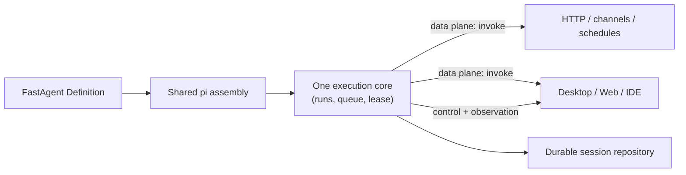

# Session control plane

The serving-extension design for FastAgent. Everything below is implemented except the demand-driven
follow-ons named in §15. It is a companion to, not a replacement for, the locked
[Agent Handler SPEC v0.1](../SPEC.md).

The design reduces to one sentence: **`invoke` is the only data plane; the session control plane
observes and modulates the runs that `invoke` drives.** A client uses `invoke` to make the agent work,
the session's own calls to intervene while it works, and `events` to watch.

It adapts the useful headless primitives from pi RPC mode (steering, follow-ups, abort, settlement,
tool progress) without exposing pi's TUI control surface, raw RPC protocol, or a second run-starting
entry point.

## 1. Decision: three planes, one execution core

| Plane | Surface | Invariant |
|---|---|---|
| **Data** | `agent.invoke(scope, prompt)` | No run exists without an invoke. Every turn, and every durable conversation write, is driven by some invoke — channel, schedule, and desktop alike. |
| **Control** | `sessions.get(id).update/steer/abort/…` | Modulates, never initiates. `steer`/`followUp` text reaches the record only through the run an invoke is driving; `abort` only changes that run's course. |
| **Observation** | `state` / `entries` / `events` | Strictly read-only. Any number of subscribers; disconnecting and resubscribing is lossless with the durable cursor; zero effect on the run. |
| **Exclusion** | the shared `Lease` | Protects writes only. A run holds it for its whole activity window. The control plane's writes (`update`, `compact`, `fork`, `delete`) are its only writers and take the same lease. |


```mermaid
flowchart LR
  D["FastAgent Definition"] --> A["Shared pi assembly"]
  A --> CORE["One execution core<br/>(runs, queue, lease)"]
  CORE -->|"data plane: invoke"| CH["HTTP / channels / schedules"]
  CORE -->|"data plane: invoke"| UI["Desktop / Web / IDE"]
  CORE -->|"control + observation"| UI
  CORE --> R["Durable session repository"]
```

There is no session handle, no `open`/`close`, and no resident object in the API. Residency is an
internal cache inside the serving process (see [§9](#9-concurrency-and-residency)), never a
prerequisite for calling any method.

The control plane MUST NOT change `Agent`, `Scope`, `Prompt`, `AgentEvent`, or the terminal semantics
in `src/agent.ts`. It lives behind a separate package subpath so interactive serving does not grow the
minimal handler contract.

## 2. Goals

- a desktop or Web client that watches a run live and intervenes: steer, queue a follow-up, abort;
- reconnect after a UI or network interruption without losing the conversation;
- live model, thinking, queue, retry, compaction, tool, and usage visibility;
- multiple observers of one session, naturally;
- engine-neutral consumers with capability gating;
- a future remote adapter without making its transport the embedded API.

## 3. Non-goals

- a second way to start agent work (that is `invoke`, only `invoke`);
- a durable task/workflow protocol or a replayable event log;
- a group-chat, account, membership, or deployment control plane;
- exactly-once tool execution;
- a remote shell API;
- a mirror of pi's TUI commands, editor state, themes, widgets, or window chrome;
- a promise that every engine implements every capability.

Product-level authorization, routing, offline queues, and durable run records belong above FastAgent.
A product runner may expose these planes remotely, but the runner owns authentication, policy,
idempotency, and device routing.

## 4. Terms and identity

| Term | Meaning |
|---|---|
| **Session** | Durable conversation tree identified by an opaque `sessionId` (the same value as `Scope.session`). |
| **Run** | One activity window: an invoke's accepted prompt until all steering, queued follow-ups, automatic retries, and overflow recovery have settled. |
| **Entry** | A durable append-only session record with a stable id. |
| **Event** | Ephemeral live progress on the observation plane. |

| ID | Minted by | Lifetime | Job |
|---|---|---|---|
| `sessionId` | host/product | durable | addresses the conversation; equals `Scope.session` |
| `runId` | engine, when an invoke starts a run | one activity window | correlates control-plane acceptance with observed outcome |
| entry `id` | session repository | durable | the reconnect cursor for `entries({ since })` |

There is deliberately no `requestId`, no `runtimeId`, and no `sequence` in the embedded contract.
In-process, each call's promise is the correlation, the `events` iterable is lossless and ordered, and
iterator termination is the epoch signal. Those concerns reappear only on the wire and belong to the
transport envelope ([§13](#13-transport-and-envelope)).

## 5. The contract

Pure types under the `@fastagent-sh/fastagent/session` subpath (`src/session.ts`); the pi
implementation lives under `engines/pi/` (`session-control.ts`, exported from `/pi`).

```ts
interface SessionControl {
  capabilities(): SessionCapabilities;
  commands(): Promise<AgentCommand[]>;
  sessions: SessionCollection;
}

interface SessionCollection {
  list(): Promise<SessionSummary[]>;
  fork(options: { from: string; at: string; into: string }): Promise<SessionResult>;
  get(session: string): Session;
}

interface Session {
  readonly id: string;
  state(): Promise<SessionState>;
  entries(options?: { since?: string }): Promise<SessionEntries>;
  events(): SessionEventStream;                           // AsyncIterable<SessionEvent> + `ready`
  update(patch: SessionUpdate): Promise<SessionResult>;   // name / model / thinkingLevel / leafEntryId
  steer(prompt: Prompt): Promise<SessionResult>;
  followUp(prompt: Prompt): Promise<SessionResult>;
  abort(): Promise<SessionResult>;
  compact(options?: { instructions?: string }): Promise<SessionResult>;
  delete(): Promise<SessionResult>;
}
```

**The shape follows the question each call answers**, and conflating the three is what an earlier
`dispatch(session, command)` did:

| Kind | Surface | Why it is its own thing |
|---|---|---|
| PROPERTIES of a session | `update(patch)` | Durable, last-wins, applied by the next turn. Setting two at once is one write, one event. |
| Things that HAPPEN to a run | `steer` / `followUp` / `abort` / `compact` | Admitted or rejected now; the outcome arrives later on the event stream. Nothing is "set". |
| The SET of sessions | `sessions.list/fork/get` | Not about one session, or (fork) about two. |

**The handle is a pure binding**: an id plus the transport it travels on. No state, no lifecycle,
nothing to dispose, and `get()` does not check that the session exists — the calls answer that, each
in its own vocabulary. Two handles for one id are interchangeable, so a client never holds something
that can go stale.

Each read survives a deletion test:

- delete `state` → a reconnecting client cannot learn whether work is still active;
- delete `entries` → disconnection means amnesia (live streams are not durable);
- delete `events` → no observers, no reconnect, no rich vocabulary without polluting `AgentEvent`;
- delete the write calls → the invoke stream is one-way; intervention requires a second, upstream
  channel.

`sessions.list()` is DEPLOYMENT-level, and that word is load-bearing: it answers for every session at
once, so a multi-tenant facade in front of one deployment must not expose it. Such a facade does not
need it either — `Scope.session` is the Caller's own opaque string, so it already holds the
user→sessions mapping this call would return. That is also why there is no prefix filter.

### 5.1 Actions and properties

There is no `prompt` action: starting work is the data plane's definition. Nothing here creates a
session from nothing — `fork` copies one that exists.

```ts
type SessionUpdate = { name?: string; model?: string; thinkingLevel?: string; leafEntryId?: string };
```

- A patch's VALIDATION is all-or-nothing: every field is checked before anything is written, so a
  patch rejected by validation leaves nothing behind. An empty patch is `ok: true`. The WRITES are not
  one operation, because an engine records properties as separate journal entries: a failure between
  them answers `partial_update`, naming what landed, after an event reporting the record as it now is.
  A field the deployment does not know rejects `unsupported_capability`; it is never dropped.
- `model` takes a FastAgent model spec, constrained by the assembled definition and host policy. It
  never accepts provider credentials. `thinkingLevel` is a string because supported levels are
  MODEL-dependent — and a patch carrying both is checked against the model it LEAVES the session on.
- `leafEntryId` moves the session's active leaf: the write verb for the tree `entries()` publishes,
  and how sibling branches come to exist (the next turn hangs off it). Every entry `entries()`
  publishes is a legal target; anything else rejects `invalid_command`. A move to where the head
  already is writes nothing. A move that travels alone DOES write one record, and it has to: an
  engine's leaf can be runtime state (pi's is), so a move nothing follows would be forgotten before
  the next turn and `state()` would contradict the event the move just emitted. That record is the
  implementation's own bookkeeping and is never published: what `entries()` shows is a self-contained
  tree, every `parentId` resolving to something it also shows. Two deliberate omissions: no
  summarization of the branch being left, and no move to the ROOT — "start from nothing" is a new
  session, not an emptied one.
- Queued messages are processed FIFO, one at a time. pi's queue-mode tuning is not exposed.
- `followUp` is polyfillable (wait for `run_settled`, then invoke); it exists because it buys
  atomicity against competing writers and queue visibility at near-zero cost. `steer` is not
  polyfillable — its delivery point is an engine primitive.
- `fork` copies a history up to `at` into a session called `into`, the growth verb beside the leaf
  move. Cloning is this with the source's own `leafEntryId`. It is IDEMPOTENT: `into` is the Caller's
  id, the record is stamped with where it came from, and repeating a fork that already landed answers
  `ok: true` and writes nothing. The same id holding a DIFFERENT history is `invalid_command`.
- `delete` destroys the record. It is the only IRREVERSIBLE call, and like every other one it is
  ungated — [§14](#14-security-boundary) explains why the framework holds no key at all.
- There are no `cycle_*` commands: cycling is a TUI input affordance.

### 5.1.1 Commands

```ts
interface AgentCommand { name: string; description?: string; source: string }
```

What a composer's `/` completion LISTS. It cannot be reconstructed client-side — the assembly is the
only place that knows the set after first-wins collision resolution, and for a REMOTE agent the files
behind it are not on the client's machine at all.

The list is what THIS agent has: the definition's skills plus the ones its machine lends, and the
machine's prompt templates (`docs/design/core.md` §5). `source` says how each is invoked — `skill` or
`prompt`, the two spellings below — which is the one thing a client needs to act on.

NOT a dispatch surface, and a client MUST NOT expand a name itself. The data plane takes prompts as
text; what a name means when it appears in one is the ENGINE's, because the engine is the side that
holds the definition — a client that read `skills/<name>/SKILL.md` and built the prompt would
re-implement loading, drift from it, and break outright against a remote agent whose files are not on
its machine. A client offers the list and sends the spelling; it does not interpret it.

Two spellings, because there are two kinds of thing. A SKILL is `/skill:<name> [args]`, expanded
server-side into the skill's body with the arguments appended — identically in-process and over
HTTP+SSE, both asserted in `test/skill-invocation.test.ts`. A PROMPT TEMPLATE is the bare `/<name>`,
pi's own spelling for it. A bare name that matches no template is ordinary text, and the model decides
whether to act on it — which is why a skill needs the prefix: without it, `/weather` would be a wish
rather than an instruction.

ONE SPELLING, NOT A NEGOTIATED ONE, and that is a known limit rather than a design: this contract has
one engine implementing it, so a client hard-codes the prefix. Nothing in `commands()` or
`capabilities()` reports it, so a second engine with a different spelling — or none — cannot be told
apart from this one, and adding it is a contract change (`AgentCommand` is public surface). Until then
the MUST NOT above is what keeps a client honest: hard-coding one engine's spelling is recoverable,
expanding the name yourself is not.

ONE silent fall-back, and it is a name nothing knows: an unknown name goes through as plain text,
because at this layer a typo and a sentence that opens with a slash are the same bytes. Checking the
name against this list first is the client's job for exactly that reason.

A skill whose FILE cannot be read is not a second one WHEN THE LIST AND THE FILE AGREE: the loader
reads it first, so an unreadable file means the skill is not in the definition this turn — it warns
(`read_failed`, with the errno and path), drops out of `commands()`, and the prefixed spelling behaves
as the unknown name above, which is what it now is. That is the ordinary case, and it is why the one
list a client compares against covers both a typo and a skill that broke.

The list can outlive the file, though: it is refreshed per invoke, while the body is read at prompt
time. A steer or follow-up inside a run, or a definition replaced under a running container, names a
file that is already gone — pi reports `skill_expansion` on its extension error channel and sends the
line unexpanded. Serving subscribes to that channel for this one reason, so the turn logs
`skill_expansion failed for <path>: <errno>` instead of quietly answering as if the name were prose.
The CALLER still gets an ordinary turn: the prompt is honest about what was sent, and nothing about a
missing file makes the run itself fail.

COMPLETE for what a data-plane client can invoke, which is what lets it bind its `/` menu to this list
and nothing else. Besides skills, the definition's `extensions/` register commands, and a `/name`
prompt dispatches to one before the model sees it. They are listed with `source: "extension"`, read
off a loader built exactly like a turn's and resolved by pi's own runner, so a name two extensions
share appears with the `:N` suffix pi dispatches, and a prompt template an extension command shadows
is dropped. The cost is that listing runs the extensions' factories; no session opens, so no
`session_start` fires. A chat channel's own `/stop` sits outside the scope: the CHANNEL intercepts it
and turns it into an `abort` before the agent sees it (`src/channels/kit/stop-command.ts`), a
platform command, not a definition name.

ASYNC on purpose: a definition is allowed to be LIVE (fastagent re-reads the directory per turn), so
the list must come from that same read. `source` is free-form because which kinds exist is an engine's
business (`"skill"` today), and an engine with none answers `[]` — a complete answer. A definition
that cannot be READ at all is a deployment fault, and this read MAY reject.

### 5.2 Acceptance is not outcome

```ts
type SessionResult =
  | { ok: true; runId?: string }             // admitted (steer/follow_up: joined this run) or applied (boundary mutations)
  | { ok: false; error: { code: string; message: string; retryable: boolean } };
```

`ok: true` means the command was admitted or applied, never that the run ultimately succeeded: run
outcomes are reported by `run_settled` and by the invoke stream's terminal event. `ok: false` means the
command did not COMPLETE, which is not the same as nothing having happened: every code except
`partial_update` is a rejection **before** acceptance with nothing durable landed, and that one names
the fields that did land (a multi-field `update` writes separate journal entries, and no engine here
can roll them back). Whether a command may be re-sent is therefore answered by `retryable`, never by
`ok` alone. Work that fails after acceptance otherwise surfaces through events and durable entries,
never as a second result.

### 5.3 Capabilities

```ts
interface SessionCapabilities {
  steering: boolean;
  followUp: boolean;
  compaction: boolean;
  fork: boolean;
  delete: boolean;
  updatable: ("name" | "model" | "thinkingLevel" | "leafEntryId")[];
  allowedModels?: string[];
  toolProgress: boolean;
  usage: boolean;
}
```

Clients MUST gate controls on capabilities; calling past a gate fails before acceptance with a stable
`unsupported_capability` code. This surface is SESSIONLESS, so nothing on it may depend on a session:
`allowedModels` may live here because the model registry is a deployment fact, while thinking LEVELS
are a property of the model a session is currently running and therefore live on
`state().availableThinkingLevels`. A static list could only answer for one model.

`updatable` is a LIST rather than a flag per field, so a client reads the same names it writes
(`caps.updatable.includes("model")` gates the model picker that `update({ model })` will use).

`state`, `entries`, `events` and `sessions.list()` are **mandatory** — the reconnect contract and the
conversation list — and deliberately absent here. Blocking interactions (typed confirm/select/input
gates that suspend a run) remain absent; they can arrive later as one negotiated capability.

## 6. Invoke as the data plane

`invoke` keeps its SPEC v0.1 shape and stays the only way to start a run, on every path.

**Settle window.** When steering or follow-ups join a run, the invoke stream terminates when the run
**settles**: steering, queued follow-ups, automatic retries, and overflow compaction have all finished
and nothing will continue automatically. For every existing consumer nothing intervenes mid-run, so a
run equals a single turn and behavior is byte-identical to today. SPEC's terminal set
`{completed, failed}` is untouched.

**Busy semantics.** An invoke against a session with an active run fails with the existing
`session_busy` code. An interactive client seeing busy chooses `steer` or `follow_up` explicitly — the
ambiguity of "send during a run" is resolved by the client's intent, never guessed.

**Projection, not translation.** `AgentEvent` is a narrow projection of the rich event stream:

| `AgentEvent` | Source `SessionEvent` |
|---|---|
| `text { delta }` | `message_delta { channel: "text" }` |
| `thinking { delta }` | `message_delta { channel: "thinking" }` |
| `tool_started` | `tool_started` |
| `tool_ended` | `tool_finished` |
| `completed { data? }` | `run_settled { status: "completed" }` |
| `failed { details, retryable, code? }` | `run_settled { status: "failed" \| "aborted" }` |

An externally aborted run projects as `failed` with `code: "aborted"`, so a channel can render
cancellation distinctly from an error. Channels MUST treat it as a settled outcome — durable
turn-intent cleanup included — so an operator's abort is never replayed as a fresh turn on restart.

Events with no `AgentEvent` counterpart (queue, compaction, retry, tool progress) are simply not
projected. The implementation translates pi events into `SessionEvent` **once** and derives the invoke
stream from it — one translation plus one projection, never two parallel translations.

## 7. State and durable recovery

```ts
interface SessionState {
  status: "idle" | "running" | "compacting";
  activeRunId?: string;
  model?: string;
  thinkingLevel?: string;
  pending: { steering: string[]; followUp: string[] };
  usage?: {
    inputTokens: number;
    outputTokens: number;
    cacheReadTokens?: number;
    cacheWriteTokens?: number;
    cost?: number;
    contextTokens?: number;
    contextWindow?: number;
  };
  leafEntryId?: string;
}
```

`compacting` refers to manual compaction at a session boundary; automatic overflow compaction happens
inside a run's activity window and reports as `running` — the observation plane's "running" window
equals the data plane's lease window, so `state()` never says idle while an invoke would be rejected
`session_busy`.

`pending` lists the prompts queued on the active run, oldest first, as the engine queued them: plain
text as sent, a slash command already expanded, images not included. A prompt leaves its list when it
enters the conversation as a user message, so a client that shows queued prompts apart from the
transcript moves one into it at that point. An abort can still end the run before the model answers
it. Whatever is still listed when the run settles never entered the conversation and is dropped;
the last `queue_changed` before `run_settled` names those prompts.

`usage` (present where `capabilities().usage` holds) is the newest answer's own numbers, not a running
total: tokens and cost as the provider reported them for the latest answer on the active path that
carries usage (an aborted or failed answer does not, so it reports the one before). `contextTokens` is how full the context is, and `contextWindow` is
the size of the running model's context. `contextTokens` is ABSENT, never zero, when it is unknown: after
a compaction or a context edit, until the next answer. The pi reference reads all of it from the record
(the answer's reported usage plus pi's estimate of what followed it), so after a finished run it equals
pi's own `getContextUsage()`. Where pi would estimate an unknown size from characters instead, it
reports unknown. A session with no answer carrying usage has no `usage`.

There is deliberately no `failed` status. A failed run settles (`run_settled { failed }`) and the
session returns to `idle`. A serving-process fault surfaces as `serving_error` plus event-iterator
termination; recovery is resubscription, not a sticky state with no defined exit.

`entries({ since })` is the durable reconnect primitive:

```ts
interface SessionEntries { entries: SessionEntry[]; leafEntryId?: string }

interface SessionEntry {
  id: string;
  parentId?: string;
  timestamp: number;
  kind: string;   // guaranteed minimum vocabulary: "user" | "assistant" | "tool"; open set beyond
  data: Json;
}
```

Entries are append-ordered with stable ids, including pre-compaction records and abandoned branches
where the engine preserves them — `parentId` exists because branches objectively occur. The `since`
cursor is an APPEND-ORDER position, not a descendant filter: in a branched session it may include
records from other branches, and the client reconstructs the active path via `parentId` chains from
`leafEntryId`. Engine-specific kinds may appear beyond the guaranteed minimum and MUST be skippable.
The pi reference publishes one with a payload: `context_edit` `{ targetId, omitted }` names an entry the
model no longer sees as written. `omitted: true` means the target left the model context; `false` means
its content was replaced (the replacement is not published). pi writes omissions for its own abandoned
retry and overflow attempts, and an extension may write either kind of edit, so an omitted entry is not
necessarily a failed one. The target stays in the transcript. An edit applies only while the
`context_edit` entry itself lies on the path from `leafEntryId`: after a move or fork to a point
between the target and the edit, the model sees the target as written.

Reconnect is four steps, and the ORDER is the contract: subscribe `events()` → `await stream.ready` →
`entries({ since: cursor })` to backfill → `state()` to learn whether work is active. Reading first
loses anything emitted between the read and the subscription, and the events most worth having there
(`state_changed`, `run_settled`) are live-only — no cursor brings them back, and a healthy connection
never reconnects to discover the gap. Subscribing first is not enough on its own: the call returning
is not the subscription existing (in process it registers on the first pull; over HTTP the server
registers before it writes the response headers), which is what `ready` makes waitable. Waiting for a
first EVENT instead cannot work — an idle session may stay quiet indefinitely — and a fixed delay only
moves the race.

Each `events()` call is ONE subscription with one readiness: iterating the same stream twice is refused,
and reconnecting means calling `events()` again.

**Keep pulling the stream while the backfill runs.** Events emitted during those two round trips are
buffered by the SERVER, per subscriber and with a ceiling (10,000 events / 8 MiB in the pi hub); a
subscriber past it is closed, which is exactly the loss the recipe exists to prevent. So the two reads
belong on a task beside a live iteration, not in front of one — the
[api-reference example](../api-reference.md#session-control-observation-plane) has that shape. The overlap that
follows is display-level: durable records may appear both in the replay and in the live stream, and
live-only events have no entry id to deduplicate against. Live events are not the durable history API; a product that needs replayable run
timelines persists normalized events above FastAgent.

The neutral state never exposes session file paths, working directories, provider base URLs,
credential sources, or engine model descriptors.

## 8. Live event model

```ts
interface SessionEvent<TType extends string = string, TData extends Json = Json> {
  type: TType;
  timestamp: number;
  runId?: string;   // present on run-scoped events
  data: TData;
}
```

In-process the stream is lossless and ordered; there is no sequence number to check and no epoch to
compare. The pi implementation caps each subscriber's backlog at 10,000 events and 8 MiB of UTF-8
JSON. Crossing either limit logs a warning and closes that subscription after its buffered prefix
drains; the client reconnects and backfills via `entries()`, so slow readers never block execution.

The vocabulary, grouped by the client maturity level that needs it:

| Level | Events | Purpose |
|---|---|---|
| L0 | `run_started`, `run_settled { status: completed \| failed \| aborted, error? }` | Run boundaries; exactly one `run_settled` per `run_started` while the serving process lives. |
| L0 | `message_started`, `message_delta { channel: "text" \| "thinking", delta }`, `message_finished` | Streaming text. Thinking MUST NOT be folded into the answer. |
| L0 | `tool_started`, `tool_progress { partialResult }`, `tool_finished` | Tool activity. `tool_progress` uses **replace semantics**: the accumulated snapshot so far, not a delta. |
| transport | `serving_error` | A transport adapter lost the serving process outside a normal run outcome. Not emittable in-process. |
| L1 | `queue_changed { steering, followUp }` | The active run's whole queue: the queued prompt texts (§7 `pending`). |
| L2 | `turn_started`, `turn_finished` | Group tool activity under one assistant turn. |
| L2 | `compaction_started/finished` | Manual compaction bounds: between runs, no `runId`; every started is closed (`summary`, `error`, or `aborted`). Automatic overflow compaction does not emit these. |
| L2 | `retry_scheduled { operation, attempt, maxAttempts, delayMs, error }` | A transient provider failure scheduled a summarization retry backoff — explains a quiet gap that would read as a hang. No closing event: the next event is the closure. |
| L2 | `state_changed { name?, model?, thinkingLevel?, leafEntryId?, usage? }` | What an `update` LANDED, read back from the record. `leafEntryId` reports a deliberate move of the branch head, not a general leaf feed. `usage` alone follows each settled run and each finished compaction; an update that moved `leafEntryId` or changed `model` carries the `usage` the session now has (absent there: it has none). A subscribed client needs no polling. |

Consumers MUST forward or ignore unknown event types; the vocabulary is additive. The contract
excludes editor replacement, themes, widgets, and all other TUI presentation surfaces.

## 9. Concurrency and residency

- **Single writer, run-scoped.** All writers — channel invoke, scheduler fire, desktop invoke — take
  the same `Lease` (`engines/pi/turn-kit.ts`) for the run's activity window. A scheduler firing into a
  session mid-run gets `session_busy` and defers.
- **The plane's writes take the lease.** `update`, `compact`, `fork` and `delete` are the control
  plane's only durable writers and are rejected `session_busy` when they would race a run.
- **Residency is an internal cache.** The serving process MAY keep a live engine session per
  recently-used sessionId. Before starting a run it revalidates against the durable record and reloads
  when stale — interleaved writers are correct, merely slower. Eviction is invisible in the contract.
- Within a run: one run at a time per session; steering and follow-ups are serialized FIFO; tool calls
  within one turn may run concurrently where the engine permits; cancellation may leave a started tool
  without a finished event; side-effecting tools remain at-least-once across process failure.
- Process affinity exists only while a run is active. Cross-instance routing belongs to a session
  router above FastAgent.

## 10. Definition fidelity

The serving planes must run the same agent that `dev`, `start`, and embedded Agent Handler run:
FastAgent prompt assembly, the same skills (definition and machine, core §5) and tools, the same deferred-tool activation,
FastAgent auth (never implicit `~/.pi` state), model policy from config, and host-owned working
directory and session repository — never client-provided paths.

`src/engines/pi/session-builder.ts` proves this assembly seam: it builds a resident pi
`AgentSessionRuntime` with FastAgent's prompt, skills, tools, auth, and agent boundary; the TUI
(`chat.ts`) is one consumer of it.

## 11. Pi capability selection

FastAgent adapts pi's concepts, never proxies `pi --mode rpc` unchanged:

| Pi surface | Decision | Reason |
|---|---|---|
| `prompt` | Map to the data plane (`invoke`) | One way to start work. |
| `steer`, `follow_up`, `abort` | Include | Core control plane. |
| `get_state`, session stats | Normalize into `state()` | Reconnect and rendering. |
| `get_entries(since)` | Include | Durable cursor recovery. |
| `agent_settled` | Adapt to `run_settled` + invoke terminal | Correct settle boundary. |
| tool progress | Include, replace semantics | Live feedback. |
| `compact`, `set_model`, `set_thinking_level`, `navigate` | Include as `compact()` and three `update` fields (§5.1) | Three of them RECORD a property, so they are one patch rather than three commands. |
| `cycle_*`, queue-mode tuning | Exclude | TUI affordances; fixed FIFO is deterministic. |
| auto-compaction/retry toggles | Exclude | Deployment policy, not per-client state. |
| `bash`, `abort_bash` | Exclude | Unsafe remote-shell bypass; duplicates tools. |
| `new_session`, `switch_session` by path | Exclude | Sessions are opaque ids; paths are not portable. |
| `export_html` | Exclude | Product presentation concerns. |
| session naming | Adapt to `update({ name })` | A conversation list needs a label the deployment holds. |
| `get_commands` | Adapt to `commands()` (§5.1.1) | The definition-derived LISTING is the one thing a client cannot reconstruct; pi's execution and presentation of slash commands stay out. |
| extension UI dialogs | Defer behind a future `interactions` capability | Permission/input gates have serving value, but not in the first contract. |
| extension UI presentation | Exclude | TUI chrome. |
| `fork` | Include, gated by `capabilities.fork` | A tree you can walk but not grow is half a tree. `clone` folds into it; `get_tree` stays out, since `entries()` already publishes the parent chain. |

## 12. Storage boundary

`PiSessionRecordStore` MUST NOT grow into the interactive API, and the line is not "how many methods"
but WHICH KIND: whole-RECORD operations (find, enumerate, copy, remove, write properties) belong here;
what happens INSIDE a turn stays behind the session the store hands back.

**It hands a `SessionManager` to exactly two callers** — the turn binding and the read path — and to
nothing that writes. While the control plane wrote properties by calling pi's append methods itself,
it had to know pi's rules to do it (every append advances the single leaf pointer, so write order
decides where a fork's head lands; `appendSessionInfo` rewrites the name it is given; a fresh record
buffers in memory until its first assistant message). `applyProperties` exists so each rule is known
once: the caller supplies a VALIDATED patch and is told what LANDED and what the record now holds.
Those behaviours are pinned in `test/pi-behaviour.test.ts`, which asserts them against pi rather than
against us.

Both backends copy a fork ENTRY BY ENTRY rather than at the file level. pi's file-level copy writes
the intermediate only once the copied path holds an assistant message, so forking at a user entry
produced a permanent failure the plane could only report as retryable. One copy path also means the
two backends cannot drift on what a fork carries.

`list` answers in CALLER ids, never storage names. The pi implementation encodes a Caller's id into a
name pi accepts (`-1001234567890` → `s-1001234567890`), and that encoding is storage detail. A name
this store did not write cannot be decoded, so it is OMITTED from a listing rather than reported under
a name nobody can use.

The pi implementation may use pi's richer session repository internally for stable entry ids and
session reconstruction; both views point at the same durable root, and all writers share the same
lease. Engine-specific records (pi JSONL, message classes) never cross the adapter.

## 13. Transport and envelope

The embedded contract is semantic-only; wire concerns exist only at the transport. As shipped
(HTTP+SSE, `createControlPlane`/`connectSessionControl`), the transport is RESTful:

```
GET    /control/capabilities
GET    /control/commands
GET    /control/sessions                       list
PUT    /control/sessions/{id}                  {from, at} — fork, idempotent
GET    /control/sessions/{id}                  state
PATCH  /control/sessions/{id}                  {name?, model?, thinkingLevel?, leafEntryId?}
DELETE /control/sessions/{id}
GET    /control/sessions/{id}/entries          ?since=
GET    /control/sessions/{id}/events           SSE
POST   /control/sessions/{id}/actions          {type: "steer"|"follow_up"|"abort"|"compact"}

POST   /invoke                                 the DATA plane (NOT this prefix — see below)
GET    /routines                           the catalogue of runnable work (also not this prefix)
POST   /run                                run one declared routine by name (also not this prefix)
```

- **PATCH for properties, POST …/actions for actions.** What a session HAS is a resource field; what
  happens TO a run is an event in time.
- **PUT for fork**, because a fork is idempotent by construction: the id is the caller's, the body says
  which history it holds, and repeating the request changes nothing. That is what makes a retry after
  a lost response safe.
- **The id is a path segment**, percent-encoded. A session id is an opaque Caller string that can
  contain `:` and `/`, so the plane matches paths SEGMENT BY SEGMENT rather than by pattern:
  `URL.pathname` leaves `%2F` encoded, so splitting on `/` cannot be fooled. Three strings are NOT
  path segments — the empty one, `.` and `..` — because URL normalisation eats them before any router
  sees them, and encoding does not help (the spec normalises `%2E` too). The transport refuses such an
  id at the binding, and the plane refuses to MINT one (`fork`). A session a channel already created
  under one keeps running and keeps appearing in `list()`; it simply cannot be addressed remotely.
- **The data plane is NOT under this prefix.** `/control/*` is REST over session resources; running a
  turn is a root verb endpoint, `POST /invoke`, the shape every LLM API of this class uses. The two
  used to be one prefix apart, and the only difference between `POST /control/invoke` and
  `POST /invoke` was the bearer token — a duplicate route standing in for an access rule. The session
  stays in the BODY rather than the path: it already carries the scope, and a Caller-minted id may
  contain `:` and `/`, which the control plane pays for in percent-encoding and this plane need not.
- **Actions and patches ride plain HTTP request/response.** Bodies are parsed field by field at the
  boundary, never cast through. An unknown key is REJECTED there, not dropped: silently ignoring it
  answers `ok: true` for a patch that set nothing. It rejects with the same `unsupported_capability`
  the in-process path answers, naming the field.
- **On the CONTROL plane's request/response routes, the status code answers whether the LOCAL call
  returns or throws — not whether the command succeeded.** That one rule produces every status those
  routes emit, and it is what makes local and remote consumers isomorphic: the client turns non-2xx
  back into a `throw` and a 2xx body back into a return value, so caller code is identical on both
  sides.

  | in process | on the wire |
  |---|---|
  | `update` / `fork` / `delete` / actions return a `SessionResult` and never throw | **200 either way**, `ok: false` included |
  | `state` / `entries` / `capabilities` / `commands` return a value | 200 |
  | `list()` throws a store fault (a coded one) | 503 with `{ code, message, retryable }` — not a `SessionResult`, because in process there is no result either; the remote client carries all three on the error it throws |
  | any other read throws — `commands()` on an unreadable definition, `list()` on something that is not a store fault | 500 from the plane's boundary |
  | the request never reached the plane (JSON, body cap, route) | 400 / 413 / 404 / 405 |

  `POST /invoke` is the exception, and for a contract reason rather than a transport one: an
  `Agent` may not throw out of its iteration (SPEC MUST 2), so `connectAgent` has no `throw` to map a
  status onto. Every non-2xx it meets — including the 400/413/405 its own handler emits — becomes a
  `failed` event whose `retryable` is derived from the status (429 and 5xx are worth re-sending).

  So an application failure and a transport failure are separate channels, which is the ordinary
  arrangement rather than an invention here: JSON-RPC over HTTP answers 200 for both result and error
  objects, MCP splits protocol errors (JSON-RPC) from tool execution errors (a successful result with
  `isError: true`), and GraphQL's `application/json` form carries `errors` under 200.

  **`ok: false` is deliberately not mapped onto 4xx/5xx.** The retry decision belongs to the client
  that can read `retryable`, and a status code hands it to every intermediary in between: HTTP
  libraries, proxies and gateways retry 5xx on their own, which for `partial_update` means re-applying
  what already landed. Mapping stays possible later — the modern GraphQL-over-HTTP rule is the shape
  to follow (the body stays authoritative and is parsed independently of the status), and the codes
  that ARE safe to signal are the ones no middleware auto-retries. It would cost a second copy of the
  same knowledge (a code→status table beside the codes themselves), so it waits for a consumer that
  needs it — a monitoring dashboard or a gateway counting failures.

  `retryable` living in the result rather than in the status is likewise the common arrangement, for
  the same layering reason: the contract exists where HTTP does not. Smithy models it as `@retryable`
  on the error shape and `@httpError` as the protocol binding — both, on the same error — and Google's
  APIs carry `RetryInfo` in `Status.details` beside the code. Temporal marks non-retryable application
  errors for the reason `partial_update` carries `retryable: false`: re-sending the identical call
  cannot succeed.
- **Events** carry the one explicit envelope:

  ```ts
  interface WireEvent { sessionId: string; epoch: string; seq: number; event: SessionEvent }
  ```

  `seq` detects loss in transit on one connection — a gap throws in the client into the normal
  reconnect steps ([§7](#7-state-and-durable-recovery)). `epoch` is INFORMATIONAL for consumers
  correlating across connections: within one connection it cannot change.

The remote adapter consumes the envelope internally and re-exposes the same `SessionControl` interface
(and `connectAgent` does the same for the data plane's `Agent`). Local and remote consumers are
isomorphic; that is the entire payoff of keeping the envelope out of the API.

**Browser reachability.** A JSON body is not a CORS-safelisted content type, and a deployment that
fronts this port with its own auth has the browser sending `Authorization` too — either one makes the
browser preflight. A Node client is unaffected (Node's fetch does not enforce CORS), which is why the
gap stayed invisible while blocking every browser client.

The policy itself is not this plane's — it belongs to the host router, for every path fastagent owns,
and §14 states it. What belongs HERE is why the plane has to be a sub-application owning the `/control`
prefix rather than a set of routes that happen to share it: three of its replies are produced where no
route runs — an unknown path under the prefix, a method a path does not serve, and a handler that
throws. Owning the prefix makes them the plane's own answers instead of the host's, which is what lets
the router put the same CORS verdict and the same 404-vs-405 rule on all of them.

- `content-type` is in the allowed headers because only three values are safelisted and
  `application/json` is not among them: allowing just `authorization` leaves precisely the WRITE routes
  unreachable while every read works.
- The allowed METHODS are whatever the preflight asked for. A preflight is a gate applied before the
  request exists, so refusing there means the real request is never sent and the client sees an opaque
  network error; saying what the plane does not serve is the real reply's job, as a `404`/`405`
  carrying the same headers and an explanation. A mount owns a prefix and does not publish which
  methods each path under it serves, so a table lookup is not available here anyway.
- `OPTIONS` is answered by the router, not by a route: a route table registering only `POST /invoke`
  cannot match it, and 404 stays distinct from 405 because a remote client reads 404 as "this serve
  predates the route".

**When a read cannot be total.** `state`/`entries`/`events` are TOTAL: their absent fields are shapes
a control-less deployment answers with too. `sessions.list()` is the first read where that is
impossible — `[]` is the honest answer for a deployment with no sessions, so a store that cannot be
enumerated must not borrow it. pi's own session listing catches every IO error and answers `[]`, so
the store reads the records directory itself and lets that read fail, treating only "the directory is
not there" as an empty store. (Guarding it with `existsSync` or `statSync({ throwIfNoEntry: false })`
was tried and is wrong: both collapse ENOTDIR and permission faults into "absent".) The rule: a read
that CAN be total stays total; one that cannot REJECTS — and rejecting in process is exactly what the
transport turns into a non-2xx (the table above), `sessions_unavailable` + 503 here.

## 14. Security boundary

**fastagent authenticates nothing, on purpose.** Not `/control/*`, not `POST /invoke`. Authentication
belongs to the deployment: a gateway, an IdP-backed proxy, a private network, AgentCore's IAM, or an
embedder's own middleware in front of the Fetch handler. This is the same line every server framework
draws, and the reason is not minimalism — a scheme the framework owns is one it owns badly:

- The plane USED to mint a per-boot bearer token. It was deployment-wide and all-or-nothing, so it
  could express no policy any real deployment needs, and it authenticated ONE prefix while the data
  plane beside it was open — which produced `POST /control/invoke`, a duplicate of `POST /invoke`
  whose only content was the token.
- It was enforced per route, by hand, twelve times. A scheme that each new route must remember is one
  some route will forget, and the failure is silent.
- It was security theatre at the only boundary that mattered: a public URL protected by one shared
  secret that every caller holds is a public URL.

**Every unauthenticated endpoint, in one list.** Whoever reaches this port can do all of it, with no
credential:

| Endpoint | What an anonymous caller gets |
|---|---|
| `POST /invoke` | A turn with this agent's full tool authority, on any session id, billed to your model account. Always served. |
| `GET /routines` | The catalogue: which names `POST /run` accepts, with each one's cron if it has one. Never a prompt. |
| `POST /run` | A turn from a prompt the definition wrote down, for any routine it declares. Both are served when there is at least one AND the data plane is on — `http.run` defaults to `http.invoke`. |
| `GET /control/sessions` | Every conversation on the deployment |
| `GET /control/sessions/{id}/entries`, `.../events` | The full contents of any one of them |
| `POST /control/sessions/{id}/actions` | Steer, abort or compact a running turn |
| `PATCH`/`PUT`/`DELETE /control/sessions/{id}` | Rewrite, fork, or IRREVERSIBLY delete a session |
| `GET /health` | Liveness |

`GET /routines` and `POST /run` appear only where `routines/` declares something, and follow `http.invoke` unless `http.run` says otherwise. `/control/*` appears only under
`sessionControl: true`, and **not at all on AgentCore**. That host has
two doors, and this plane fits neither:

- The forwarder's Function URL is `AuthType: NONE` — it has to be, since a platform's webhook cannot
  sign with SigV4 — and it relays an arbitrary path verbatim while attaching the ingress secret
  itself, so every anonymous caller arrives as trusted ingress. A channel route survives that because
  it verifies its platform's signature inside itself; this plane has nothing to verify. So the relay
  reaches the channels' routes only.
- The Runtime's own `InvokeAgentRuntime` is IAM-gated, and the forwarder emits only four envelope
  kinds (`webhook`, `routine-fire`, `wake-poke`, `probe`), so a kind it never sends can only come
  from a direct IAM call. That is how `kind: "invoke"` runs a turn here with no ingress secret, and a
  `kind: "control"` on the same footing is the recipe if this is ever wanted.

It is not wanted yet: `connectSessionControl` has no caller in this repo, and that envelope is
request/response with a buffered body, so `GET /control/sessions/{id}/events` — the one route a GUI
renders from — could not ride it. Half a plane, for nobody, on a third transport. Both `deploy
agentcore` and the container's boot say `sessionControl: true` is inert here rather than dropping it
quietly. `POST /invoke` is on by default on every
serve — `http.invoke: false` is its off switch, for a public port whose channels' signature checks are
meant to be the only way in. The startup and deploy warnings name what actually mounted, so turning
either off removes it from them.

**What this obliges.** Everything below §14 assumes the port itself is the boundary. `dev` binds
loopback; `start` binds all interfaces because a container needs that, and says so at startup;
`--tunnel` publishes the whole port; `fastagent deploy` warns on every deployment, naming `/invoke`
and adding `/control/*` when it is on. Each of those warnings names what the table above lists, not
just the prefix — the warning used to be conditioned on `sessionControl`, so a definition serving only
Telegram published `POST /invoke` on a public URL and heard nothing. A deployment that needs
per-principal policy — including per-principal `delete` — builds it in the facade below.

**This is an API, and a browser is a caller like any other.** Origin is not access control: what makes
a normal API safe to call cross-origin is that it demands a credential the page does not have, which
makes the caller's origin irrelevant. We have no credential, so the only thing separating "the
legitimate caller" from "any page the user visited" is NETWORK POSITION — the exact ambient authority
the same-origin policy exists to protect. Two mechanisms follow from that, and only one of them is
policy.

**1. A route that authenticates nobody refuses a body that is not JSON** (`channels/body.ts`, applied
by the router over the whole unverified surface). A protocol rule, not a list, nothing to configure.
A POST carrying `text/plain`, `multipart/form-data` or `application/x-www-form-urlencoded` is a CORS
*simple request*: no preflight, sent regardless of what the server would have answered, so withholding
the response headers only stops the page from READING a turn that has already run and been billed.
Requiring `application/json` takes the request out of that class, so the browser must preflight it —
and a preflight we do not answer is a request that is never sent. Asked of the ROUTE, never of "does
this have a body": the control plane reads an empty body as `{}`, so a body-less POST would otherwise
walk straight through. `GET` has no side effect here and the browser blocks the read anyway.

**2. CORS, and the default is `*`** (`channels/serve.ts`). Origin is not access control: what makes any
API safe to call from a page is a credential the page does not have. We have none, and the boundary
that replaces it — who may reach this port — belongs to the deployment, by the same rule that removed
the bearer token. Deciding it from a signal this process can observe (which address it bound) is not
that rule: a wildcard bind is what a container needs, a loopback one is `dev`'s default, and neither is
something the operator said.

**Know what `*` grants.** Any page the user's browser visits can call this port cross-origin and read
the reply — `POST /invoke` is a turn with the agent's full tool authority, and `sessionControl: true`
adds reading, rewriting and deleting sessions. On a published port that is nothing an attacker could
not already curl. On a loopback `dev` serve it is the whole attack path: a loopback bind stops a
process on another machine, not a page in your own browser. **A long-running `dev` serve should be
treated as drivable by any page you visit.** `announceControl` says this at every boot, including on
loopback, because nobody opts into a default.

- **`http.cors` is the only way to take it back**, and when set it REPLACES the default rather than
  adding to it: `["https://app.example.com"]` pins that origin and refuses every other, including your
  own loopback page. `["*"]` is the default said out loud. `*` cannot be combined with cookie
  credentials (the browser refuses), so a gateway doing cookie auth needs the exact origin.
- **A channel's route is exempt from both mechanisms**, because it verifies its platform's signature
  inside itself — a Telegram webhook is public on purpose, and Slack posts urlencoded. For a CUSTOM
  channel that is an assumption about its author, not a property we enforce: verifying the caller is
  the channel's half of this boundary (decision B), and a channel that verifies nothing is as
  reachable from a page as `POST /invoke` would be without mechanism 1.
- **An origin `http.cors` does not list is simply not answered** — no headers, no refusal. Refusing
  would mean policing same-origin writes too (a browser sends `Origin` on those), which costs a
  special case for the serve's own host and buys nothing mechanism 1 does not already cover.
- **The router, not the handlers.** It is the only layer that can answer an `OPTIONS` preflight for a
  route registered under `POST` alone, the only one that sees the 404/405 it writes itself, and the
  only one that covers a route added later. `createInvokeHandler` keeps its own copy of mechanism 1
  because it is a public standalone artifact (`docs/overview.md` mounts it as one route in someone
  else's app) — a handler you can mount anywhere has to be safe anywhere, and there is no router in
  front of it. It gets no CORS that way; the host app's middleware owns that.

A non-browser client sends no `Origin`, so mechanism 2 never applies to it (mechanism 1 still does —
it is about the route, not the caller). `connectSessionControl` / `connectAgent` take `fetchFn`: wrap
`fetch` there to add, refresh or sign whatever the thing in front of the serve demands.

One thing neither mechanism covers, recorded so it is not rediscovered: a cross-origin `GET` to
`/control/sessions/{id}/events` is a simple request, so it is sent and the server subscribes, even
though the page cannot read a byte of it. That costs a held connection, not a disclosure.

KNOWN GAP (decided in issue #573, closed as not planned): DNS rebinding. The page rebinds its own hostname to `127.0.0.1`, so
its requests become same-origin — no `Origin` to judge, and any content type it likes, which defeats
mechanism 1 as well.

Note what changed when the cross-origin default became `*`: rebinding is no longer NEEDED to reach a
loopback serve from a page, since an ordinary cross-origin call is now answered. What it still buys an
attacker is the rest of mechanism 1 — a same-origin request may carry any content type, so the JSON
gate stops applying, and a `dev` serve narrowed by `http.cors` is reachable again despite the list.

The only thing left to check would be `Host`, and this is a deliberate decision not to:

- Closing it costs a config key. A loopback-only `Host` rule cannot be unconditional: `cloudflared`
  forwards the original `Host` by default (`httpHostHeader` is empty), and so do Caddy and Traefik. We
  know when `--tunnel` is on and could exempt it; we do not know about the operator's reverse proxy,
  so a same-host facade — the deployment shape recommended below — would meet a 403 with no way to
  answer it unless we also ship a host allowlist. (nginx happens to pass: its default is
  `proxy_set_header Host $proxy_host`.)
- It closes a narrower gap than it used to. With `*` as the default, the page a developer visits can
  already drive a loopback serve without any DNS trick; `Host` validation would take back the
  `http.cors` narrowing, not the default.

So a `dev` serve left running is worth treating as drivable by any page the developer visits, and by
an attacker who controls DNS even when `http.cors` is pinned. If that matters, stop the serve, or put
it behind something that authenticates.

**The multi-tenant facade.** N users behind one deployment, each reaching only their own sessions: the
facade authenticates its user, reads the session id out of the request, checks it against its OWN
user→session mapping, and forwards to the deployment with the deployment token. It never parses a
command, and it gains no new capability when the plane does. Four properties make the pass-through
safe:

- **Every CONTROL call names its session in the URL** — one path segment, percent-encoded (§13), so
  the facade routes on a prefix. It must compare the DECODED segment against its own mapping: `%61bc`
  and `abc` are one session, and a Feishu id containing `/` never matches raw.
- **`events` subscribes per session** rather than filtering a global stream, so a tenant cannot
  observe another's run by holding a connection open.
- **The lease is per session** (§9), so a busy tenant answers `session_busy` to itself alone.
- **Extraction is not authorisation.** Taking the id out of the path enforces nothing, and the plane
  authenticates nothing. There is no per-session permission inside to half-configure and get wrong:
  the facade holds all of it.

**The trap: the path says where a call WRITES, the body says where it READS.** Two calls take a second
session id, and neither is in the URL:

| Call | Checked by a facade reading the path | Also needs checking |
|---|---|---|
| `POST /invoke` | — (the session is in the BODY, not the path) | `session` AND `parentSession` — the latter inherits the parent's history into the new session |
| `PUT /control/sessions/{id}` | `{id}`, the fork's destination | `from` in the body — the history's SOURCE |

A facade that authorises only what it finds in the path lets a user read any conversation on the
deployment by naming it as a `parentSession` or a fork `from`. `invoke` is doubly easy to miss: it is
the DATA plane, so a facade written around "the control routes" may not guard it at all — and it is
the one that WRITES.

`capabilities` and `commands` are agent-level with no user data and pass through as-is.
`GET /control/sessions` must NOT be exposed — it returns every session on the deployment (§5), and a
facade already holds the per-user mapping a filtered list would return. The deployment's own port must
not be reachable by end users: nothing behind the facade authenticates anything, so a user who can
reach past it holds every session. A same-host facade wants `--bind 127.0.0.1`, with two consequences: the
plane and the channel webhooks share one server and one bind, so loopback takes Telegram/Feishu/Slack
ingress off the network too; and `--tunnel` is ALLOWED with that bind (cloudflared dials the name
`localhost`) but republishes the port on a public URL, which is what the loopback bind was for. A
facade deployment does not use both.

A remotely exposed control plane MUST be wrapped by a host that enforces: an authenticated principal
and per-session authorization; separated observe and write permissions; allowed model and
thinking-level policy; prompt and attachment size limits; opaque artifact references instead of
filesystem paths; audit records for accepted commands. The control plane does not make local coding
tools safe for untrusted users; `ExecutionEnv` is still not a complete sandbox boundary
([core design §5](core.md#5-tools-skills-and-execution-environment)).

## 15. Decisions on the record

- **Definition fidelity for chat.** The definition-aware session builder (`session-builder.ts`) is
  independently instantiable and `runPiChat` is one consumer; the TUI-only `~/.pi` auth divergence was
  eliminated in place.
- **Observation.** pi events translate ONCE to `SessionEvent` inside the invoke path (`toSessionEvent`);
  `AgentEvent` is its projection (`projectAgentEvent`). `state`/`entries`/`events` read the store's
  read-only `openIfExists`. Conformance tests cover projection fidelity, run boundaries, reconnect,
  and single-writer.
- **Run modulation.** `steer`/`follow_up`/`abort` reach the live run via the `RunControls` registered
  with `run_started`; the settle window spans steered/queued continuations inside one invoke; a
  control-plane abort terminates as `failed{code: "aborted"}` / `run_settled{aborted}`; idle-session
  run actions reject `no_active_run` before acceptance.
- **Boundary mutations under the lease.** `update({ model | thinkingLevel })` appends durable session
  overrides, validated against the registry and the MODEL's own thinking levels (`invalid_command`
  before acceptance). The per-invoke resolve (`resolveSessionSettings`) applies them on every later
  turn and clamps recorded and configured levels to the selected model's capabilities. A recorded
  model absent from the registry resolves to the configured default. `state()`, the update gate, and
  the per-invoke binding all read that same resolution.
- **`compact` is accept-fast.** A summarization is a full model call, so the dispatch answers on
  admission and the outcome travels as `compaction_finished{summary|error|aborted}`, emitted after the
  lease frees. Pre-acceptance failures reject `boundary_command_failed` with nothing durable landed
  (not retryable when pi itself refused); a session with no compactable history rejects
  `nothing_to_compact`. An in-flight compaction is
  abortable and converges as `compaction_finished{aborted}`.
- **The leaf is movable.** `update({ leafEntryId })` moves it through pi's `SessionManager.branch()`
  under the same lease; an unknown target rejects `invalid_command`; the move rides out as
  `state_changed{leafEntryId, model, thinkingLevel}`. Every last-wins read therefore reads the ACTIVE
  PATH, not the flat journal. An unreadable chain never resolves silently to assembly defaults:
  `state()` stays total but leaves the settings pair absent, and the fault surfaces where an error
  code exists.
- **Transport.** `createControlPlane` (engine-neutral, unauthenticated like every other route) serves
  §13's surface. `connectSessionControl` re-exposes the SAME `SessionControl` and consumes the envelope
  internally. The data plane is its own root route: `POST /invoke` + `connectAgent`.
  `config.sessionControl: true` makes dev/start mount the plane; product runners own authentication,
  idempotency, event persistence and routing (§14).
- **Lifecycle.** `sessions.list()` is the deployment's conversation list in CALLER ids; `fork` is
  idempotent; `delete` ends the session's live streams rather than holding connections open on a
  record that is gone. No `create` and no `clone`. `GET /control/sessions` is the first read that MAY
  reject — a store that cannot be enumerated answers `sessions_unavailable` + 503.

Demand-driven follow-ons, explicitly not prerequisites: a subprocess transport adapter beside the
HTTP+SSE one, blocking interactions, definition reload, export, and channel upgrades — a chat channel
becoming an events consumer for message-boundary delivery, or an interaction responder once
interactions exist.

Considered and rejected — **replacing the chat channels' queued-turn path with `steer`/`follow_up`**:
the stateful channels persist each accepted turn intent BEFORE the transport ACK (at-least-once, crash
replay); a message folded into a live run as a steer exists only in that run's in-memory queue, so a
process crash silently loses it. Any future adoption must first give steered messages the same
durable-intent treatment.

Shipped from that list — **the user-facing stop command**: `ChannelContext.control?` hands channels the
hub for DISPATCH only, and the chat channels map an explicit user stop (Telegram `/stop`; a bare
"stop"/"cancel" summon on Slack/Feishu/Lark) onto `abort`. The hub itself is NOT gated: a serve always
builds it, because `abort` reaches the live run through the controls `run_started` carried and needs no
boundary wiring — asking an author to publish a remote management surface in order to stop a turn was
paying for the wrong thing. `config.sessionControl` gates what it always meant to gate: serving
`/control/*`, and wiring the boundary that makes writes possible at all. The stop message is a control
action, never a turn; only the ACTIVE run is aborted — queued durable turns are independent asks and keep
their at-least-once floor.

## 16. Invariants

Implementation review should reject changes that violate these:

1. Agent Handler v0.1 semantics and the frozen terminal set stay unchanged; additive advisory
   `failed.code` constants in `src/agent.ts` are allowed.
2. `invoke` holds no state between calls.
3. No run exists without an invoke; the control plane modulates, never initiates.
4. The observation plane is strictly read-only.
5. All durable session writes happen under the shared lease.
6. Residency is an invisible cache: no residency lifecycle in the contract, correctness via durable
   revalidation.
7. Acceptance is not outcome; `ok: false` means the command did not complete — rejected before
   acceptance for every code but `partial_update`, which names what landed. `retryable` is what
   answers whether it may be re-sent.
8. The embedded contract is semantic-only; correlation, ordering, and epoch identity live in the
   transport envelope.
9. FastAgent Definition artifacts, not ambient pi globals, determine behavior; pi imports stay under
   `src/engines/pi/`.
10. Engine paths, models, messages, and repositories never leak into the neutral contract.
11. Live events are ordered but never presented as durable history.
12. TUI presentation APIs and remote-shell shortcuts stay out.
