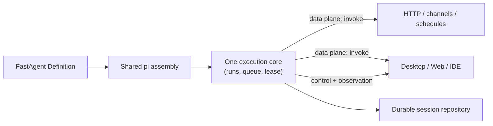

# Session control plane

This document is the serving-extension design for FastAgent. Everything below is implemented except
the demand-driven follow-ons named in §15 (a subprocess transport adapter among them). It is a
companion to, not a replacement for, the locked [Agent Handler SPEC v0.1](../SPEC.md).

The whole design reduces to one sentence: **`invoke` is the only data plane; the session control
plane observes and modulates the runs that `invoke` drives.** A client uses `invoke` to make the
agent work, the session's own calls to intervene while it works, and `events` to watch.

The design adapts the useful headless primitives from pi RPC mode (steering, follow-ups, abort,
settlement, tool progress) without exposing pi's TUI control surface, raw RPC protocol, or a
second run-starting entry point.

## 1. Decision: three planes, one execution core

| Plane | Surface | Invariant |
|---|---|---|
| **Data** | `agent.invoke(scope, prompt)` | No run exists without an invoke. Every turn, and every durable conversation write, is driven by some invoke — channel, schedule, and desktop alike. |
| **Control** | `sessions.get(id).update/steer/abort/…` | Modulates, never initiates. `steer`/`followUp` text reaches the record only through the run an invoke is driving; `abort` only changes that run's course. |
| **Observation** | `state` / `entries` / `events` | Strictly read-only. Any number of subscribers; disconnecting and resubscribing is lossless with the durable cursor; zero effect on the run. |
| **Exclusion** | the shared `Lease` | Protects writes only. A run holds it for its whole activity window. The control plane's writes (`update`, `compact`, `fork`, `delete`) are its only writers and take the same lease. |


```mermaid
flowchart LR
  D["FastAgent Definition"] --> A["Shared pi assembly"]
  A --> CORE["One execution core<br/>(runs, queue, lease)"]
  CORE -->|"data plane: invoke"| CH["HTTP / channels / schedules"]
  CORE -->|"data plane: invoke"| UI["Desktop / Web / IDE"]
  CORE -->|"control + observation"| UI
  CORE --> R["Durable session repository"]
```

There is no session handle, no `open`/`close`, and no resident object in the API. Residency is an
internal cache inside the serving process (see [§9](#9-concurrency-and-residency)), never a
prerequisite for calling any method. This is what "residency is an execution optimization, not the
source of continuity" means when taken seriously: the optimization is invisible in the contract.

The control plane MUST NOT change `Agent`, `Scope`, `Prompt`, `AgentEvent`, or the terminal
semantics in `src/agent.ts`. It lives behind a separate package subpath so interactive serving does
not grow the minimal handler contract.

## 2. Goals

- a desktop or Web client that watches a run live and intervenes: steer, queue a follow-up, abort;
- reconnect after a UI or network interruption without losing the conversation;
- live model, thinking, queue, retry, compaction, tool, and usage visibility;
- multiple observers of one session, naturally;
- engine-neutral consumers with capability gating;
- a future remote adapter without making its transport the embedded API.

## 3. Non-goals

- a second way to start agent work (that is `invoke`, only `invoke`);
- a durable task/workflow protocol or a replayable event log;
- a group-chat, account, membership, or deployment control plane;
- exactly-once tool execution;
- a remote shell API;
- a mirror of pi's TUI commands, editor state, themes, widgets, or window chrome;
- a promise that every engine implements every capability.

Product-level authorization, routing, offline queues, and durable run records belong above
FastAgent. A product runner may expose these planes remotely, but the runner owns authentication,
policy, idempotency, and device routing.

## 4. Terms and identity

| Term | Meaning |
|---|---|
| **Session** | Durable conversation tree identified by an opaque `sessionId` (the same value as `Scope.session`). |
| **Run** | One activity window: an invoke's accepted prompt until all steering, queued follow-ups, automatic retries, and overflow recovery have settled. |
| **Entry** | A durable append-only session record with a stable id. |
| **Event** | Ephemeral live progress on the observation plane. |

Three identifiers, each with an irreducible job:

| ID | Minted by | Lifetime | Job |
|---|---|---|---|
| `sessionId` | host/product | durable | addresses the conversation; equals `Scope.session` |
| `runId` | engine, when an invoke starts a run | one activity window | correlates control-plane acceptance with observed outcome |
| entry `id` | session repository | durable | the reconnect cursor for `entries({ since })` |

There is deliberately no `requestId`, no `runtimeId`, and no `sequence` in the embedded contract.
In-process, each call's promise is the correlation, the `events` iterable is lossless and
ordered, and iterator termination is the epoch signal. Those concerns reappear only on the wire and
belong to the transport envelope ([§13](#13-transport-and-envelope)).

## 5. The contract

Pure types under the `@fastagent-sh/fastagent/session` subpath (`src/session.ts`); the pi
implementation lives under `engines/pi/` (`session-control.ts`, exported from `/pi`).

```ts
interface SessionControl {
  capabilities(): SessionCapabilities;
  commands(): Promise<AgentCommand[]>;
  sessions: SessionCollection;
}

interface SessionCollection {
  list(): Promise<SessionSummary[]>;
  fork(options: { from: string; at: string; into: string }): Promise<SessionResult>;
  get(session: string): Session;
}

interface Session {
  readonly id: string;
  state(): Promise<SessionState>;
  entries(options?: { since?: string }): Promise<SessionEntries>;
  events(): AsyncIterable<SessionEvent>;
  update(patch: SessionUpdate): Promise<SessionResult>;   // name / model / thinkingLevel / leafEntryId
  steer(prompt: Prompt): Promise<SessionResult>;
  followUp(prompt: Prompt): Promise<SessionResult>;
  abort(): Promise<SessionResult>;
  compact(options?: { instructions?: string }): Promise<SessionResult>;
  delete(): Promise<SessionResult>;
}
```

**The shape follows the question each call answers.** Three kinds, and conflating them is what the
earlier `dispatch(session, command)` did:

| Kind | Surface | Why it is its own thing |
|---|---|---|
| PROPERTIES of a session | `update(patch)` | Durable, last-wins, applied by the next turn. Setting two at once is one write, one event. |
| Things that HAPPEN to a run | `steer` / `followUp` / `abort` / `compact` | Admitted or rejected now; the outcome arrives later on the event stream. Nothing is "set". |
| The SET of sessions | `sessions.list/fork/get` | Not about one session, or (fork) about two. |

The old single verb made a client spell the session id on every call and read `{ type: "delete" }`
as something dispatched INTO a session that is about to stop existing. Ten command variants also hid
that four of them (`set_model`, `set_thinking`, `set_name`, `navigate`) were the same operation —
recording a property — which is why they are now four fields of one patch.

**The handle is a PURE BINDING**: an id plus the transport it travels on. No state, no lifecycle,
nothing to dispose, and `get()` does not check that the session exists — the calls answer that, each
in its own vocabulary. Two handles for one id are interchangeable, which is what keeps the interface
flat in the sense that matters: a client never holds something that can go stale.

Each read survives a deletion test:

- delete `state` → a reconnecting client cannot learn whether work is still active (the durable
  record does not know whether the process died);
- delete `entries` → disconnection means amnesia (live streams are not durable);
- delete `events` → no observers, no reconnect, no rich vocabulary without polluting `AgentEvent`;
- delete the write calls → the invoke stream is one-way; intervention physically requires a second,
  upstream channel.

`sessions.list()` survives it at the product level: without it a GUI can drive one conversation but
cannot tell a person which conversations exist on the deployment it manages — and that is most of
what managing a deployment means. It is DEPLOYMENT-level, and that word is load-bearing: it answers
for every session at once, so a multi-tenant facade in front of one deployment must not expose it.
Such a facade does not need it either — `Scope.session` is the Caller's own opaque string, so it
already holds the user→sessions mapping this call would return. That is why there is no prefix
filter: it would be designing for the one consumer that does not want the call.

### 5.1 Actions and properties

There is no `prompt` action: starting work is the data plane's definition. And nothing here creates a
session from nothing — `fork` copies one that exists.

```ts
type SessionUpdate = { name?: string; model?: string; thinkingLevel?: string; leafEntryId?: string };
```

- A patch's VALIDATION is all-or-nothing: every field is checked before anything is written, so a
  rejected patch leaves nothing behind — the property that makes `ok: false` safe to retry. An empty
  patch is `ok: true`. The WRITES are not one operation, because an engine records properties as
  separate journal entries: a failure between them answers `partial_update`, naming what landed,
  after an event reporting the record as it now is. Claiming a rollback the engine cannot perform
  would be the one lie a client has no way to recover from. A field the deployment does not know
  rejects `unsupported_capability`; it is never dropped.
- `model` takes a FastAgent model spec, constrained by the assembled definition and host policy. It
  never accepts provider credentials. `thinkingLevel` is a string because supported levels are
  MODEL-dependent — and a patch carrying both is checked against the model it LEAVES the session on,
  not the one it is on now.
- `leafEntryId` moves the session's active leaf: the write verb for the tree `entries()` publishes,
  and how sibling branches come to exist (the next turn hangs off it). Every entry `entries()`
  publishes is a legal target — including boundary records the engine already leaves the leaf on —
  and anything else rejects `invalid_command`. A move to where the head already is writes nothing.
  A move that travels alone DOES write one record, and it has to: an engine's leaf can be runtime
  state (pi's is — reopening a record puts it back on the file's last entry), so a move nothing
  follows would be forgotten before the next turn, and `state()` would contradict the event the move
  just emitted. That record is the implementation's own bookkeeping and is never published: what
  `entries()` shows is a self-contained tree, every `parentId` resolving to something it also shows.
  Two deliberate omissions: no summarization of the branch being left (a model call,
  engine-flavoured, and not what moving a leaf means), and no move to the ROOT — "start from
  nothing" is a new session, not an emptied one.
- Queued messages are processed FIFO, one at a time. pi's queue-mode tuning is not exposed.
- `followUp` is polyfillable (wait for `run_settled`, then invoke); it exists because it buys
  atomicity against competing writers and queue visibility, at near-zero cost since steering needs
  the queue anyway. `steer` is not polyfillable — its delivery point is an engine primitive.
- `fork` copies a history up to `at` into a session called `into` — the growth verb beside the leaf
  move's walk, and the two together are what make a session tree usable. Cloning is this with the
  source's own `leafEntryId`. It is IDEMPOTENT: `into` is the Caller's id, the record is stamped with
  where it came from, and repeating a fork that already landed answers `ok: true` and writes nothing.
  A client retrying a request whose response it never saw does not get a second record; the same id
  holding a DIFFERENT history is `invalid_command`, because that is what the id would be lying about.
- `delete` destroys the record. It is the only IRREVERSIBLE call, and it is guarded by the same
  bearer token as everything else — see [§14](#14-security-boundary) for why that grain is the honest
  one rather than a second gate.
- There are no `cycle_*` commands: cycling is a TUI input affordance.

### 5.1.1 Commands

```ts
interface AgentCommand { name: string; description?: string; source: string }
```

What a composer's `/` completion LISTS. A listing, deliberately not an invocation surface: the data
plane takes prompts as text, and nothing in it expands `/name` — so what typing one means (expanding
the skill, sending "use the X skill", filtering a menu) is the client's business, and the contract
says so rather than implying an invocation path that does not exist.

It still cannot be reconstructed client-side: the assembly is the only place that knows the set after
collisions were resolved first-wins, and there is no way to discover it by trying.

ASYNC on purpose: a definition is allowed to be LIVE (fastagent re-reads the directory per turn), so
the list must come from that same read. A boot snapshot would advertise names the running agent has
already left behind. `source` is free-form because which kinds exist is an engine's business
(`"skill"` today; extension commands and prompt templates as they land), and an engine with none
answers `[]` — a complete answer, not a missing one. A definition that cannot be READ at all is a
deployment fault, and this read may reject: unlike a session-scoped condition, there is no truthful
degraded value (`[]` would claim the agent has no names).

### 5.2 Acceptance is not outcome

```ts
type SessionResult =
  | { ok: true; runId?: string }             // admitted (steer/follow_up: joined this run) or applied (boundary mutations)
  | { ok: false; error: { code: string; message: string; retryable: boolean } };
```

`ok: true` means the command was admitted or applied. It never means the run ultimately succeeded:
run outcomes are reported by `run_settled` on the observation plane and by the invoke stream's
terminal event. `ok: false` is guaranteed to mean rejection **before** acceptance — the only case
that is safe to blindly retry. Work that fails after acceptance surfaces through events and durable
entries, never as a second result for the same call.

### 5.3 Capabilities

```ts
interface SessionCapabilities {
  steering: boolean;
  followUp: boolean;
  compaction: boolean;
  fork: boolean;
  delete: boolean;
  updatable: ("name" | "model" | "thinkingLevel" | "leafEntryId")[];
  allowedModels?: string[];
  toolProgress: boolean;
  usage: boolean;
}
```

Clients MUST gate controls on capabilities; calling past a gate fails before acceptance with a stable
`unsupported_capability` code. This surface is SESSIONLESS, so nothing on it may depend on a session:
`allowedModels` may live here because the model registry is a deployment fact (any session may be
pointed at any of it), while thinking LEVELS are a property of the model a session is currently
running and therefore live on `state().availableThinkingLevels`. A static list of them could only
ever answer for one model — which is what made an earlier constant advertise every level on a
non-reasoning model, with the write then accepting a level no run would use.

`updatable` is a LIST rather than a flag per field, so a client reads the same names it writes
(`caps.updatable.includes("model")` gates the model picker that `update({ model })` will use). It
replaced three separate flags and one that was named after a command — the shape a derived map could
never have produced.

`state`, `entries`, `events` and `sessions.list()` are **mandatory** — the reconnect contract and the
conversation list — and deliberately absent here. Blocking interactions (typed confirm/select/input
gates that suspend a run for user input) remain absent; they can arrive later as one negotiated
capability without changing this contract.

## 6. Invoke as the data plane

`invoke` keeps its SPEC v0.1 shape and stays the only way to start a run, on every path.

**Settle window.** When steering or follow-ups join a run, the invoke stream terminates when the
run **settles**: steering, queued follow-ups, automatic retries, and overflow compaction have all
finished and nothing will continue automatically. For every existing consumer — channels,
schedules, HTTP — nothing intervenes mid-run, so a run equals a single turn and behavior is
byte-identical to today. SPEC's "one turn = one invoke" gains a clarifying sentence ("a turn is the
activity window of one invoke") when the control plane lands; its terminal set `{completed,
failed}` is untouched.

**Busy semantics.** An invoke against a session with an active run fails with the existing
`session_busy` code. An interactive client seeing busy chooses `steer` or `follow_up` explicitly —
the ambiguity of "send during a run" is resolved by the client's intent, never guessed.

**Projection, not translation.** `AgentEvent` is a narrow projection of the rich event stream:

| `AgentEvent` | Source `SessionEvent` |
|---|---|
| `text { delta }` | `message_delta { channel: "text" }` |
| `thinking { delta }` | `message_delta { channel: "thinking" }` |
| `tool_started` | `tool_started` |
| `tool_ended` | `tool_finished` |
| `completed { data? }` | `run_settled { status: "completed" }` |
| `failed { details, retryable, code? }` | `run_settled { status: "failed" \| "aborted" }` |

An externally aborted run projects as `failed` with `code: "aborted"`, so a channel can render
cancellation distinctly from an error. Channels MUST treat it as a settled outcome — durable
turn-intent cleanup included — so an operator's abort is never replayed as a fresh turn on restart.

Events with no `AgentEvent` counterpart (queue, compaction, retry, tool progress) are
simply not projected. The implementation translates pi events into `SessionEvent` **once** and
derives the invoke stream from it — one translation plus one projection, never two parallel
translations.

## 7. State and durable recovery

```ts
interface SessionState {
  status: "idle" | "running" | "compacting";
  activeRunId?: string;
  model?: string;
  thinkingLevel?: string;
  pending: { steering: number; followUp: number };
  usage?: {
    inputTokens: number;
    outputTokens: number;
    cacheReadTokens?: number;
    cacheWriteTokens?: number;
    cost?: number;
    contextTokens?: number;
    contextWindow?: number;
  };
  leafEntryId?: string;
}
```

`compacting` refers to manual compaction (`compact`) at a session boundary; automatic overflow
compaction happens inside a run's activity window (before its `run_settled`) and reports as
`running` — the observation plane's "running" window equals the data plane's lease window, so
`state()` never says idle while an invoke would still be rejected `session_busy`.

There is deliberately no `failed` status. A failed run settles (`run_settled { failed }`) and the
session returns to `idle` — the conversation is intact and can continue. A serving-process fault
surfaces as `serving_error` plus event-iterator termination; recovery is resubscription, not a
sticky state with no defined exit.

`entries({ since })` is the durable reconnect primitive:

```ts
interface SessionEntries { entries: SessionEntry[]; leafEntryId?: string }

interface SessionEntry {
  id: string;
  parentId?: string;
  timestamp: number;
  kind: string;   // guaranteed minimum vocabulary: "user" | "assistant" | "tool"; open set beyond
  data: Json;
}
```

Entries are append-ordered with stable ids, including pre-compaction records and abandoned branches
where the engine preserves them — `parentId` exists because branches objectively occur (compaction)
even though branching commands are deferred. The `since` cursor is an APPEND-ORDER position ("every
record appended after this id"), not a descendant filter: in a branched session it may include
records from other branches, and the client reconstructs the active path via `parentId` chains from
`leafEntryId`. The guaranteed `kind` minimum is what a reconnecting client needs to render a
conversation; engine-specific kinds may appear beyond it and MUST be skippable.

Reconnect is four steps: `entries({ since: cursor })` to backfill → `state()` to learn whether work
is active → resubscribe `events()` → continue. Live events are not the durable history API; a
product that needs replayable run timelines persists normalized events above FastAgent.

The neutral state never exposes session file paths, working directories, provider base URLs,
credential sources, or engine model descriptors.

## 8. Live event model

Events carry semantics and nothing else:

```ts
interface SessionEvent<TType extends string = string, TData extends Json = Json> {
  type: TType;
  timestamp: number;
  runId?: string;   // present on run-scoped events
  data: TData;
}
```

In-process the stream is lossless and ordered; there is no sequence number to check and no epoch to
compare. The pi implementation caps each subscriber's backlog at 10,000 events and 8 MiB of UTF-8 JSON.
Crossing either limit, including a single oversized event, logs a warning and closes that subscription
after its buffered prefix drains. The client reconnects and backfills via `entries()`; slow readers
never block the agent's execution.

The vocabulary, grouped by the client maturity level that needs it:

| Level | Events | Purpose |
|---|---|---|
| L0 | `run_started`, `run_settled { status: completed \| failed \| aborted, error? }` | Run boundaries; exactly one `run_settled` per `run_started` while the serving process lives. |
| L0 | `message_started`, `message_delta { channel: "text" \| "thinking", delta }`, `message_finished` | Streaming text. The text/thinking distinction of `AgentEvent` is preserved; thinking MUST NOT be folded into the answer. |
| L0 | `tool_started`, `tool_progress { partialResult }`, `tool_finished` | Tool activity. `tool_progress` uses **replace semantics**: the accumulated snapshot so far, not a delta. |
| transport | `serving_error` | A transport adapter lost the serving process outside a normal run outcome (fail visibly). Not emittable in-process — a dead process has no one left to emit. |
| L1 | `queue_changed { steering, followUp }` | Normalized queue depths. |
| L2 | `turn_started`, `turn_finished` | Group tool activity under one assistant turn. |
| L2 | `compaction_started/finished` | Manual compaction bounds: between runs, no `runId`; every started is closed (`summary`, `error`, or `aborted` — a deliberate stop is not a failure). Automatic overflow compaction stays inside its run and does not emit these. |
| L2 | `retry_scheduled { operation, attempt, maxAttempts, delayMs, error }` | A transient provider failure scheduled a summarization retry backoff — explains a quiet gap that would otherwise read as a hang. Inside a run (auto-compaction / branch summary, `runId`) or during manual compaction (no `runId`). No closing event: the next event is the closure. |
| L2 | `state_changed { name?, model?, thinkingLevel?, leafEntryId? }` | What an `update` LANDED, read back from the record — a patch that set two fields reports both, one that failed partway reports only what applied. `leafEntryId` reports a deliberate move of the branch head, not a general leaf feed: a turn advances the leaf too, and that is read from `entries()`/`state()` after the run. |

Consumers MUST forward or ignore unknown event types; the vocabulary is additive. The contract
deliberately excludes editor replacement, themes, widgets, and all other TUI presentation surfaces.

## 9. Concurrency and residency

- **Single writer, run-scoped.** All writers — channel invoke, scheduler fire, desktop invoke —
  take the same `Lease` (the existing injectable port in `engines/pi/turn-kit.ts`) for the run's
  activity window. A scheduler firing into a session mid-run gets `session_busy` and defers, the
  same mechanism and behavior as today.
- **The plane's writes take the lease.** `update`, `compact`, `fork` and `delete` are the
  control plane's only durable writers; they acquire the lease like a run does and are rejected
  `session_busy` when they would race one.
- **Residency is an internal cache.** The serving process MAY keep a live engine session per
  recently-used sessionId. Before starting a run it revalidates against the durable record (leaf
  entry id) and reloads when stale — so interleaved writers are correct, merely slower. Eviction is
  a policy (idle/LRU), invisible in the contract.
- Within a run: one run at a time per session; steering and follow-ups are serialized FIFO; tool
  calls within one turn may run concurrently where the engine permits; cancellation may leave a
  started tool without a finished event; side-effecting tools remain at-least-once across process
  failure.
- Process affinity exists only while a run is active. Cross-instance routing of control-plane calls
  to the process hosting the run belongs to a session router above FastAgent.

## 10. Definition fidelity

The serving planes must run the same agent that `dev`, `start`, and embedded Agent Handler run:
FastAgent prompt assembly, definition-local skills and tools, the same deferred-tool activation,
FastAgent auth (never implicit `~/.pi` state), model policy from config, and host-owned working
directory and session repository — never client-provided paths.

The shared builder `src/engines/pi/session-builder.ts` (extracted from the TUI launcher)
proves this assembly seam: it builds a resident pi `AgentSessionRuntime` with FastAgent's prompt,
skills, tools, auth, and agent boundary; the TUI (`chat.ts`) is one consumer of it. The
formerly TUI-only `~/.pi` auth divergence was eliminated in place, not inherited.

## 11. Pi capability selection

FastAgent adapts pi's concepts, never proxies `pi --mode rpc` unchanged:

| Pi surface | Decision | Reason |
|---|---|---|
| `prompt` | Map to the data plane (`invoke`) | One way to start work. |
| `steer`, `follow_up`, `abort` | Include | Core control plane. |
| `get_state`, session stats | Normalize into `state()` | Reconnect and rendering. |
| `get_entries(since)` | Include | Durable cursor recovery. |
| `agent_settled` | Adapt to `run_settled` + invoke terminal | Correct settle boundary. |
| tool progress | Include, replace semantics | Live feedback. |
| `compact`, `set_model`, `set_thinking_level`, `navigate` | Include with policy — as `compact()` and three `update` fields (§5.1) | Explicit client controls. Three of them RECORD a property, so they are one patch rather than three commands. |
| `cycle_*`, queue-mode tuning | Exclude | TUI affordances; fixed FIFO is deterministic. |
| auto-compaction/retry toggles | Exclude | Deployment policy, not per-client state. |
| `bash`, `abort_bash` | Exclude | Unsafe remote-shell bypass; duplicates tools. |
| `new_session`, `switch_session` by path | Exclude | Sessions are opaque ids; paths are not portable. |
| `export_html` | Exclude | Product presentation concerns. |
| session naming | Adapt to `update({ name })` (§5.1) | A conversation list needs a label the deployment holds; the client cannot store one for a session it did not create. |
| `get_commands` | Adapt to `commands()` (§5.1.1) | The definition-derived LISTING is included — it is the one thing a client cannot reconstruct. pi's execution and presentation of slash commands stay out: fastagent's data plane takes prompts as text and does not expand `/name`. |
| extension UI dialogs | Defer behind a future `interactions` capability | Permission/input gates have serving value, but not in the first contract. |
| extension UI presentation | Exclude | TUI chrome. |
| `fork` | Include, gated by `capabilities.fork` (§5.1) | The growth verb beside the leaf move — a tree you can walk but not grow is half a tree. `clone` folds into it (fork at the leaf); `get_tree` stays out, since `entries()` already publishes the parent chain. |

## 12. Storage boundary

`PiSessionRecordStore` MUST NOT grow into the interactive API, and the line is not "how many methods"
but WHICH KIND: whole-RECORD operations (find, enumerate, copy, remove, write properties) belong
here; what happens INSIDE a turn stays behind the session the store hands back.

**It hands a `SessionManager` to exactly two callers** — the turn binding and the READ path — and to
nothing that writes. That was learned rather than designed: while the control plane wrote properties
by calling pi's append methods itself, it had to know pi's rules to do it (every append advances the
single leaf pointer, so write order decides where a fork's head lands; `appendSessionInfo` rewrites
the name it is given; a fresh record buffers in memory until its first assistant message). Those
facts were then half-known in two modules, and the same one would be got wrong twice. `applyProperties`
exists so each is known once: the caller supplies a VALIDATED patch (what a model spec means is its
business, not the store's) and is told what LANDED and what the record now holds.

The behaviours themselves are pinned in `test/pi-behaviour.test.ts`, which asserts them against pi
rather than against us — each one was a defect before it was a test, and a pi upgrade that changes an
answer turns that file red instead of a channel three layers away.

Both backends copy a fork ENTRY BY ENTRY rather than at the file level. pi can copy a path into a new
file, and the disk store used to, but that pair writes the intermediate only once the copied path
holds an assistant message — so forking at a user entry produced a permanent failure the plane could
only report as retryable. One copy path also means the two backends cannot drift on what a fork
carries.

`list` answers in CALLER ids, never storage names. The pi implementation encodes a Caller's id into a
name pi accepts (`-1001234567890` → `s-1001234567890`), and that encoding is storage detail: a listing
that leaked it would hand a client strings it cannot dial back. A name this store did not write
cannot be decoded, so it is OMITTED from a listing rather than reported under a name nobody can use.
Records written before this store existed lie outside its directory and are not read at all.

The pi implementation may use pi's richer session repository internally for stable entry ids
and session reconstruction; both views point at the same durable root, and all writers share the
same lease. Engine-specific records (pi JSONL, message classes) never cross the adapter.

## 13. Transport and envelope

The embedded contract is semantic-only; wire concerns exist only at the transport. As SHIPPED
(HTTP+SSE, `createControlPlane`/`connectSessionControl`), the transport is RESTful, and the mapping
is mechanical because the contract already sorted its calls by kind:

```
GET    /control/capabilities
GET    /control/commands
GET    /control/sessions                       list
PUT    /control/sessions/{id}                  {from, at} — fork, idempotent
GET    /control/sessions/{id}                  state
PATCH  /control/sessions/{id}                  {name?, model?, thinkingLevel?, leafEntryId?}
DELETE /control/sessions/{id}
GET    /control/sessions/{id}/entries          ?since=
GET    /control/sessions/{id}/events           SSE
POST   /control/sessions/{id}/actions          {type: "steer"|"follow_up"|"abort"|"compact"}
POST   /control/invoke                         the DATA plane
```

- **PATCH for properties, POST …/actions for actions.** What a session HAS is a resource field; what
  happens TO a run is an event in time, and forcing those into one shape is what made a single
  `POST /control/dispatch` carry ten different meanings.
- **PUT for fork**, because a fork is idempotent by construction: the id is the caller's, the body
  says which history it holds, and repeating the request changes nothing. That is the definition of
  PUT, and it is what makes a retry after a lost response safe — the alternative (POST + a minted id)
  produces a second record every time the network eats a reply.
- **The id is a path segment**, percent-encoded. A session id is an opaque Caller string that can
  contain `:` and `/` (a Feishu thread key does), so the plane matches paths SEGMENT BY SEGMENT
  rather than by pattern: `URL.pathname` leaves `%2F` encoded, so splitting on `/` cannot be fooled
  by an id that contains one. Three strings are NOT path segments, though — the empty one, `.` and
  `..` — because URL normalisation eats them before any router sees them, and encoding does not
  help (the spec normalises `%2E` too). A request for `.` would arrive as one for the collection: a
  200 that an SSE reader ends as a silently empty stream. So the transport refuses such an id at the
  binding, and the plane refuses to MINT one (`fork`). A session a channel already created under one
  keeps running and keeps appearing in `list()` — hiding it would be the silent half of the same
  problem — it simply cannot be addressed remotely.
- **`POST /control/invoke` stays at the prefix**, not under a session: its body already carries the
  scope (SPEC `invoke(scope, prompt)`), and two places to say one thing is a place for them to
  disagree.
- **Actions and patches ride plain HTTP request/response** — the request correlation the design once
  sketched as a `WireCommand.id` is implicit in HTTP itself. Bodies are parsed field by field at the
  boundary (never cast through). An unknown key is REJECTED there, not dropped: silently ignoring it
  answers `ok: true` for a patch that set nothing, which is what a client typo and a newer client
  talking to an older serve both look like. It rejects with the same `unsupported_capability` the
  in-process path answers, naming the field.
- A `SessionResult` rides HTTP **200 either way**: `ok: false` is a protocol-level answer (rejected
  before acceptance), not a transport failure. A non-2xx means the transport or auth failed — or,
  for the one read that may reject, that the store could not be enumerated.
- **Events** carry the one explicit envelope:

  ```ts
  interface WireEvent { sessionId: string; epoch: string; seq: number; event: SessionEvent }
  ```

  `seq` detects loss in transit on one connection — a gap throws in the client (the consumer's
  failure budget and diagnostics own it) into the normal reconnect steps
  ([§7](#7-state-and-durable-recovery)). `epoch` is INFORMATIONAL for consumers correlating across
  connections: within one connection it cannot change, so the client does not compare it — a
  serving-process restart surfaces as its connections dropping.

The remote adapter consumes the envelope internally and re-exposes the same `SessionControl`
interface (and `connectAgent` does the same for the data plane's `Agent`). Local and remote
consumers are isomorphic; that is the entire payoff of keeping the envelope out of the API.

**Browser reachability.** The bearer token travels in `Authorization`, which is not CORS-safelisted,
so a browser preflights EVERY call to the plane — including a plain `GET`. `fastagent attach` is
unaffected (Node's fetch does not enforce CORS), which is why the gap stayed invisible while
blocking every browser client.

The plane is therefore mounted as ONE sub-application owning the `/control` prefix, not as a set of
routes that happen to share it. That is a correctness property, not tidiness: CORS belongs to every
reply that LEAVES the plane, and three of those are produced where no route runs — an unknown path
under the prefix, a method a path does not serve, and a handler that throws. As separate routes
those three came from the host, outside anything the plane could decorate, and each surfaced as a
bare "network error" in a browser. Owning the prefix makes them the plane's own answers, and the
headers go on at the single exit they share.

What it advertises: `access-control-allow-origin: *`, `access-control-allow-headers:
authorization, content-type`, and allowed METHODS **per path**. Each value is forced.

- `*` is the answer rather than a concession — authorisation here is the token, never the origin
  and never a cookie, so an origin that cannot present it gets 401 either way, and a deployment
  cannot know the origins of the GUIs that will manage it (the asymmetry [§14](#14-security-boundary)
  settles).
- `content-type` because only three values are safelisted and `application/json` is not among them:
  a browser POSTing to `…/actions`, `PATCH`, `PUT` or `invoke` names it in the preflight, so allowing just
  `authorization` leaves precisely the WRITE routes unreachable while every read works.
- Per-path methods, PLUS whatever the preflight asks for. The advertised set describes what the
  path serves, but a preflight is a gate applied before the request exists: refusing there means the
  real request is never sent and the client sees an opaque network error — the failure this exists
  to remove. So every preflight under the prefix is answered `204`, and the requested method is
  allowed even where the path does not serve it. The plane owns this prefix; saying what it does not
  serve is its own reply's job, as a `404`/`405` carrying these headers and an explanation.

`OPTIONS` is answered before any auth — a preflight carries no token, which is its entire purpose —
and 404 stays distinct from 405, because a remote client reads 404 as "this serve predates the
route" (skew) rather than as a fault.

**When a read cannot be total.** `state`/`entries`/`events` are TOTAL: their absent fields are shapes
a control-less deployment answers with too, which is what lets a client rely on them for reconnect.
`sessions.list()` is the first read where that is impossible — `[]` is the honest answer for a deployment
with no sessions, so a store that cannot be enumerated must not borrow it. That costs the engine
more than a pass-through: pi's own session listing catches every IO error and answers `[]`, so the
store reads the records directory itself and lets that read fail, treating only "the directory is not
there" as an empty store. (Guarding it instead was tried twice and was wrong both times —
`existsSync` answers false for any stat failure, and `statSync`'s `throwIfNoEntry: false` returns
undefined for ENOTDIR as well as ENOENT. A mechanism trusted to surface a fault it never sees is
worse than none, because it stops anyone from looking.) The rule, decided once for
every read that follows: a read that CAN be total stays total; one that cannot REJECTS, and the
transport carries the same error shape a `SessionResult` does (`{ code, message, retryable }`) on a
non-2xx — `sessions_unavailable` + 503 here. The in-process contract keeps its return types; the
vocabulary does not fork. What is NOT acceptable is the uncoded failure: an earlier iteration let a
read throw into a bare 500, and the only client that existed could classify it just one way — "the
endpoint is unreachable" — spending its reconnect budget on a condition reconnecting cannot fix.

## 14. Security boundary

**Who mints the token.** By default the serve mints one per boot and writes it to
`<stateRoot>/control.json` (0600) — a LOCAL discovery channel whose trust boundary is filesystem
permissions, which holds because `fastagent attach` and a desktop app share a filesystem with the
serving process. A deployment removes that premise: a token minted inside the container is unreadable
from outside and replaced on every restart, so the plane is publicly reachable yet unusable. There the
deployer owns the secret — `FASTAGENT_CONTROL_TOKEN` is set as a deploy secret (`fastagent deploy`
lists it whenever `sessionControl: true`), and the serve honours it instead of minting. It is not
minted for you: a value minted per deploy rotates under whoever is holding it.

**`delete` and the one key.** The lifecycle brings the plane's first irreversible call, and the
bearer token is deployment-wide and all-or-nothing. A second gate in front of `delete` was considered
and rejected: the framework owns exactly one key, so a second lock on the same door changes who can
open it not at all. The grain is honest rather than free — whoever holds the token can already read
every entry and abort every run; `delete` adds that the loss is permanent. A deployment that needs
per-principal destructive policy owes it at the wrapping host, which is where this section already
puts authorisation.

**The multi-tenant facade.** That wrapping host has one shape worth naming, because the plane was
built to make it possible and none of it is visible from the route list. N users behind one
deployment, each reaching only their own sessions: the facade authenticates its user, reads the
session id out of the request, checks it against its OWN user→session mapping, and forwards to the
deployment with the deployment token. It never parses a command, and it gains no new capability when
the plane does.

Four properties make the pass-through safe. Each is load-bearing — remove one and the pattern needs
the facade to understand what it forwards:

- **Every CONTROL call names its session in the URL** — one path segment, percent-encoded (§13), so
  the facade routes on a prefix. It must compare the DECODED segment against its own mapping, because
  that is what the plane addresses: `%61bc` and `abc` are one session, and a Feishu id containing `/`
  never matches raw. The DATA plane is the exception that costs the most to learn late:
  `POST /control/invoke` names its session in the BODY (see the trap below).
- **`events` subscribes per session** rather than filtering a global stream, so a tenant cannot
  observe another's run by holding a connection open.
- **The lease is per session** (§9), so a busy tenant answers `session_busy` to itself alone.
- **Authentication and extraction are separate in the plane itself.** The bearer guard authenticates;
  taking the id out of the path is extraction and enforces nothing. There is no per-session
  permission inside to half-configure and get wrong — the facade owns that question whole.

**The trap: the path says where a call WRITES, the body says where it READS.** Two calls take a
second session id, and neither one is in the URL:

| Call | Checked by a facade reading the path | Also needs checking |
|---|---|---|
| `POST /control/invoke` | — (the session is in the BODY, not the path) | `session` AND `parentSession` — the latter inherits the parent's history into the new session |
| `PUT /control/sessions/{id}` | `{id}`, the fork's destination | `from` in the body — the history's SOURCE |

A facade that authorises only what it finds in the path lets a user read any conversation on the
deployment by naming it as a `parentSession` or a fork `from`. Both are extension fields on a call
whose primary id checks out, which is exactly where an ownership check is not looked for. `invoke` is
doubly easy to miss: it is the DATA plane, so a facade written around "the control routes" may not
guard it at all — and it is the one that WRITES.

The rest sorts cleanly: `capabilities` and `commands` are agent-level with no user data and pass
through as-is. `GET /control/sessions` must NOT be exposed — it returns every session on the
deployment (§5), and a facade already holds the per-user mapping that a filtered list would return,
so it should answer from that instead of forwarding. And the deployment's own port must not be
reachable by end users: the bearer token is deployment-wide, so a user who can reach past the facade
holds every session. A same-host facade wants `--bind 127.0.0.1`, with two consequences to plan for.
The plane and the channel webhooks share one server and one bind, so loopback takes Telegram/Feishu/
Slack ingress off the network too — either proxy those paths through the facade as well, or keep the
port public and put the facade in front of it elsewhere. And `--tunnel` is ALLOWED with that bind
(cloudflared dials the name `localhost`, which `127.0.0.1` answers), so nothing stops the two being
combined — but the tunnel republishes the port on a public URL, which is precisely what the loopback
bind was for. A facade deployment does not use both.

A remotely exposed control plane MUST be wrapped by a host that enforces: an authenticated
principal and per-session authorization; separated observe and write permissions; allowed model
and thinking-level policy; prompt and attachment size limits; opaque artifact references instead of
filesystem paths; audit records for accepted commands. The control plane does not make local coding tools
safe for untrusted users; `ExecutionEnv` is still not a complete sandbox boundary
([core design §5](core.md#5-tools-skills-and-execution-environment)).

## 15. Decisions on the record

What each part of the plane settled on, where the reason is not obvious from the interface:

- **Definition fidelity for chat.** The definition-aware session builder (`session-builder.ts`) is
  independently instantiable and `runPiChat` is one consumer; the TUI-only `~/.pi` auth divergence
  was eliminated in place, and auth source and `thinkingLevel` converged to serving.
- **Observation.** pi events translate ONCE to `SessionEvent` inside the invoke path
  (`toSessionEvent`); `AgentEvent` is its projection (`projectAgentEvent`). `state`/`entries`/`events`
  read the store's read-only `openIfExists`. Conformance tests cover projection fidelity, run
  boundaries (cancellation → exactly one `run_settled{aborted}`), reconnect, and single-writer.
- **Run modulation.** `steer`/`follow_up`/`abort` reach the live run via the `RunControls` registered
  with `run_started`; the settle window spans steered/queued continuations inside one invoke (pi's
  loop drains both queues within one `prompt()`); a control-plane abort terminates as
  `failed{code: "aborted"}` / `run_settled{aborted}`; idle-session run actions reject `no_active_run`
  before acceptance.
- **Boundary mutations under the lease.** `update({ model | thinkingLevel })` appends durable session
  overrides, validated against the registry and the MODEL's own thinking levels (`reasoning` +
  `thinkingLevelMap`, not the bare scale; `invalid_command` before acceptance). The per-invoke resolve
  (`resolveSessionSettings`) applies them on every later turn; a registry change across deploys falls
  back to the default with a deduped warn instead of bricking the session. `state()`, the update gate
  and the per-invoke binding all read that ONE resolution — model and thinking level are one setting,
  so deriving them separately is what let the surfaces disagree.
- **`compact` is accept-fast.** §5.2 has no exceptions: a summarization is a full model call, so the
  dispatch answers on admission (lease held, session bound) and the outcome travels as
  `compaction_finished{summary|error|aborted}`, emitted after the lease frees. Pre-acceptance failures
  (binding the session, local preparation) reject `boundary_command_failed` with nothing durable
  landed; a session with no compactable history rejects `nothing_to_compact` (a no-op, like
  `no_active_run`). An in-flight compaction is abortable — run/compaction symmetry: both are model
  calls a client must be able to stop — and converges as `compaction_finished{aborted}`.
- **The leaf is movable.** `update({ leafEntryId })` moves it through pi's `SessionManager.branch()` (a
  pointer move, no record written) under the same lease; an unknown target rejects `invalid_command`; the move
  rides out as `state_changed{leafEntryId, model, thinkingLevel}`. Every last-wins read — the
  activation/override walk, `state()`, the update gate — therefore reads the ACTIVE PATH, not the
  flat journal. An unreadable chain never resolves silently to assembly defaults: `state()` stays
  total but leaves the settings pair absent, and the fault surfaces where an error code exists (the
  next invoke's `failed`, a boundary dispatch's `boundary_command_failed`).
- **Transport.** `createControlPlane` (engine-neutral, bearer token REQUIRED) serves the RESTful
  surface in §13 with the envelope born at the wire (`{sessionId, epoch, seq, event}` per SSE
  message; HTTP itself is the request correlation). `connectSessionControl` re-exposes the SAME
  `SessionControl` and consumes the envelope internally — a seq gap ends the iterator into the
  standard reconnect steps; a server restart is the same rule (its connections drop); `epoch` is
  informational across connections and never compared within one. The data plane travels too:
  `POST /control/invoke` + `connectAgent`. `config.sessionControl: true` makes dev/start mount the
  routes, mint a per-boot token and write `<stateRoot>/control.json` (0600); product runners own
  real authentication, idempotency, event persistence and routing (§14).
- **Lifecycle.** `sessions.list()` is the deployment's conversation list in CALLER ids (a facade must
  not expose it); `fork` is idempotent (the id is the caller's, the record carries its provenance, a
  repeat writes nothing); `delete` ends the session's live streams rather than holding connections
  open on a record that is gone. No `create` (an empty session is the data plane's job) and no
  `clone` (it is `fork` at the leaf). Four of the former dispatch variants RECORDED a property, so
  they became `update(patch)`; the rest are actions on a run; the collection is its own thing (§5).
  `GET /control/sessions` is the first read that MAY reject — a store that cannot be enumerated
  answers `sessions_unavailable` + 503.

Demand-driven follow-ons, explicitly not prerequisites: a subprocess transport adapter beside the
HTTP+SSE one, blocking interactions (typed confirm/select/input gates that suspend a run), definition
reload, export, and channel upgrades — a chat channel becoming an events consumer for
message-boundary delivery (enabling an opt-in follow_up/steer policy for mid-run messages) or, once
interactions exist, an interaction responder (e.g. Telegram inline keyboards). The extension unlocks
those options; it does not mandate them.

Considered and rejected — **replacing the chat channels' queued-turn path with `steer`/`follow_up`**:
the stateful channels persist each accepted turn intent BEFORE the transport ACK (L1, at-least-once,
crash replay); a message folded into a live run as a steer exists only in that run's in-memory queue,
so a process crash silently loses it. Trading the durability floor for lower latency inverts the
channels' design center. Any future adoption must first give steered messages the same durable-intent
treatment (which is exactly the opt-in policy sketched above — an events consumer at message
boundaries — not a replacement of the queue).

Shipped from that list — **the user-facing stop command**: `ChannelContext.control?` hands channels
the hub for DISPATCH only (observation stays on the data plane — the `retrying` event precedent),
and the chat channels map an explicit user stop (Telegram `/stop`; a bare "stop"/"cancel" summon on
Slack/Feishu/Lark) onto `abort`. Decisions: the hub stays gated by `config.sessionControl` (no
hub → a visible "not enabled" notice, never a silent ignore); the stop message is a control action,
never a turn (it must not queue behind the run it stops); only the ACTIVE run is aborted — queued
durable turns are independent asks and keep their at-least-once floor.

## 16. Invariants

Implementation review should reject changes that violate these:

1. Agent Handler v0.1 semantics and the frozen terminal set stay unchanged; additive advisory
   `failed.code` constants in `src/agent.ts` are allowed (the `SESSION_BUSY_CODE` precedent —
   `ABORTED_CODE` followed it).
2. `invoke` holds no state between calls.
3. No run exists without an invoke; the control plane modulates, never initiates.
4. The observation plane is strictly read-only.
5. All durable session writes happen under the shared lease.
6. Residency is an invisible cache: no residency lifecycle in the contract, correctness via durable
   revalidation.
7. Acceptance is not outcome; `ok: false` always means rejected before acceptance.
8. The embedded contract is semantic-only; correlation, ordering, and epoch identity live in the
   transport envelope.
9. FastAgent Definition artifacts, not ambient pi globals, determine behavior; pi imports stay
   under `src/engines/pi/`.
10. Engine paths, models, messages, and repositories never leak into the neutral contract.
11. Live events are ordered but never presented as durable history.
12. TUI presentation APIs and remote-shell shortcuts stay out.
